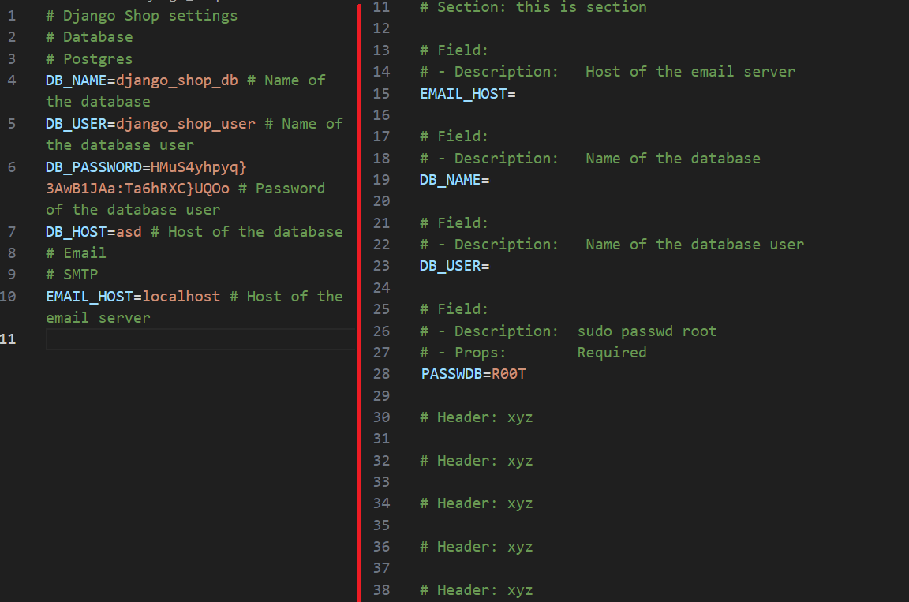

<!---------------------------------------------------------------------->
<!----------------             Introduction             ---------------->
<!---------------------------------------------------------------------->
\section*{Introduction}
\label{sec:introduction}
\addcontentsline{toc}{section}{\nameref{sec:introduction}}

\subsection*{Background}
In today's world, **Command Line Interfaces** (CLI) programs also called *shell scripts* are important puzzle pieces in almost every stage and position of the *Information Technology* (IT) industry. 
From debugging the network connection with the usage of *ifconfig* command in the terminal of Unix-based Operating Systems (*ipconfig* for Windows) or setting up a virtual machine with Docker on a remote machine via SSH. Without this small but important part of the software industry that is available on all modern operating systems, Computer Science (CS) would miss a great ally that drives all parts of this industry. One of the first closest things that resemble the Command-Line Interfaces that we know today was introduced half a century ago in OS called CTSS (Compatible Time-Sharing System) [@Corbat1992CTSStheCT] by MIT in the early 1960s, this impacted the newly developed system in 1971 called Unix [@Bourne1978UnixTS] that introduced the first shell called Thompson Shell (tsh) made by Ken Thompson. A few years later in 1979 UNIX 7 introduced a new and improved shell the Bourne Shell (sh) that became standard for the next shell generations including Microsoft OS in MS-DOS for IBM PC in 1981. In 1989 Brian Fox created Bash (Bourne Again Shell) [@newham2005learning] the shell that all Linux and macOS users are most familiar with. Command Line Interface takes the best parts of all shells created in '60s-70s of XX century and makes it so great that is it currently used by millions of users even on Windows systems by third-party software, for example, Git Bash that is automatically installed on Windows when you install git version control system [@spinellis2012git]

The important part of Shells are **Environment Variables** that were introduced in Unix 7 with the introduction of Bourne Shell, they were invented to maintain information of configuration to share them with running programs [@gray2003interprocess] for specific users, they can store data of particular paths to files or programs and could be used by all programs and processes in system and shell (see [Fig 1](#fig:envar_example) ), these variables can be found under ``.bash_profile`` or ``.bashrc`` in Bash. Today they are not only an integral part of the most widely used operating systems but also very useful for configuring *virtual machines* (VMs) that are currently on the rise and are used in many areas of development. In 2012 company called Heroku, one of the providers of online virtual machine services also known as *clouds* introduced ``.env`` file also known as **dotenv** for Ruby, and because of its ease of use they were quickly adopted by a new and fast-growing node.js community back in 2013 as dotenv node module [@dotenv_heroku_2012]. They usually are used to store settings, tokens, passwords, API keys, and credentials for services like databases or APIs, downside of dotenv files is that because they are plain text files they are not encrypted and can be easily read by anyone who has access to the file, because of this they never should be published or committed to places where someone could have access to them, for example, zip, GitHub, GitLab or friend on chat. Because of that many developers create ``.env.example`` files with empty or dummy values, because of its nature, it is far from the ideal solution, on the other hand for teams that need to share the same configuration, there is a solution called *dotenv vaults*.

{ height=100px #fig:envar_example }

\newpage

\subsection*{Motivation}
This thesis focused on this undeveloped part that is sharing dotenv in public repositories for example in GitHub, by creating a new solution as the CLI tool that will help create safer, easier to use and fill, more intuitive versions of .env.example files that developers currently rely on in form of schemas (schematic files) that will be a form of serialization data without sharing precious keys and passwords with the outside world and are easy to deserialize back even by beginners. That is important that the schema files can be used even without the CLI tool as an alternative to ``.env.example`` files themselves and not be changed to some kind of structure format like JSON or YAML, because that will force usage of this tool to get our precious ``.env`` file back from schema format and we want to prevent forcing users to change what they like. In the engineering work big focus will be put on developing a Python CLI framework around that with good code practices that will be easily decoupled from the dotenv schema solution itself, current CLI frameworks focus on the CLI part only but today's users want to move more, and more from CLI's to more GUI's or web-based apps. This thesis as well as the project itself will be developed and taken to a discussion to give a different interface approach than the other similar solutions for the reason of trying to change the CLI stage to give a new perspective as well as discover new possibilities for the future of CLI's.

This tool can one day improve the workflow of millions of developers across the globe who are using dotenv files in their everyday work, It could give them better comfort and flexibility with those files mainly due to not forceful nature of the tool that the output schema files will be in format that will be almost identical to current ``.env`` and ``.env.example`` files but will give extra point of knowledge for the tool by including the data in form of specifically and precisely design comments before each fields. Tool that is a part of the thesis will be shared publicly on MIT License at GitHub as well as the thesis for other developers, researchers, and scientists to give people an opportunity to learn and improve based on this work, The biggest tools that we are using today are open-sourced including whole systems like Linux. The project will be developed in Python 3 programming language, because of its simplicity, readability, and rich ecosystem of libraries and frameworks that make it easy to build a variety of programs that can be used on a multitude of operating systems. The software will be designed to be flexible, extensible, and easy to integrate into existing development workflows, making it a valuable addition to the toolkit of modern software developers. This utility should provide a valuable resource for developers, enabling them to work more effectively and efficiently with environment variables and dotenv files in their needs. The project will be developed with the newest code practices and SOLID methodologies to ensure proper adapters, fabricators, and other good practices for easy maintenance and extendability of future features as well as being as Pythonic as it is possible. Also to keep best practices in place there will be included unit tests of dotenv schema part of the project to ensure that the tool meets the requirements and objectives of the engineering work. The tool will be tested and validated to ensure its functionality, reliability, and usability, and the test results and analysis to identify any potential issues or areas for improvement. The tool will be compared with alternative solutions and their possible impact on the domain and the community, and the conclusions will highlight the significance of the CLI tool as well as the importance of the work in advancing best practices in software development.

To assume all of the above, my motivation to create this tool is to provide a user-friendly and secure approach to better and more sharable version environment variables files commonly known as dotenv across projects, as a developer myself I know how much time and effort it takes to manage environment variables even with help of dotenv files especially on multiple devices, I have been using dotenv files for years and I know the limitations and challenges associated with them, I believe that there is a need for a more efficient and secure solution for sharing environment variables in projects, and I am excited to contribute to the development community by providing a new approach for this field of CS (Computer Science). I'm also looking forward to using this piece of technology myself in my and others everyday work, I believe that this will provide a valuable resource for the developer community by opening not only a fresh view of dotenv files but also the approach of the CLI tools in general with exchangeable interfaces and the possibility of using it as a library in other projects or even as a whole framework for CLI's like Flask for web applications. 

\newpage

\subsection*{Objectives}

The main objective of this engineering work is to develop a base for a CLI framework with exchangeable interfaces and provide an example of the tool build on that that will give a new horizon for the current dotenv approach, the tool will be designed to facilitate and streamline work with environment variables by ensuring efficiency, intuitiveness, ease of use, scalability, and shareability. The specific objectives of the engineering work are as follows:

  - Research and analyze the existing solutions for both dotenv files and CLI frameworks.
    
    > This objective will involve reviewing the current state of the art in environment variable management and CLI tools, including an examination of the features, limitations, and advantages of existing solutions. The goal is to identify the best practices and common challenges associated with managing environment variables and dotEnv files, as well as to understand the needs and requirements of developers in this area. The research will provide the foundation for the development of the software and ensure that it addresses the most relevant issues and provides valuable features to the development community.

  - Design models both for the CLI framework and the tool itself.

    > It will require analyzing the domain of the needs of modern CLIs as well as approach that will be taken in this particular area and schema files based on common practices and challenges associated with management and sharing dotEnv files. This part will provide data model of domains and requirements for the development of the this tool, it will also impact the architecture and functionality of the program.

  - Develop a CLI tool with Python.

    > Based on the knowledge gathered before designing the architecture and functionality of the CLI tool, including its main features, capabilities, and user interface. The development of the tool will follow best practices in software engineering, including SOLID principles, design patterns, and clean code practices. The tool will be implemented using the Python 3 programming language, leveraging its rich ecosystem of libraries and frameworks for building command line applications. The development process will include stages such as planning, design, implementation, testing, and validation, ensuring that the tool meets the requirements and objectives of the engineering work.

  - Test and validate the CLI tool to ensure its functionality, reliability, and usability.

    > After the development of the tool, it will be tested and validated to ensure its functionality, reliability, and usability. This objective will involve creating a test plan and test cases for the CLI tool, including unit tests, integration tests, and user acceptance testing. The goal is to ensure that the tool performs as expected, meets the quality standards, and provides a user-friendly experience for developers. The test results and analysis will be used to validate the functionality and reliability of the tool, as well as to identify any potential issues or areas for improvement.

  - Compare the CLI tool with alternative solutions and analyze its impact on the domain and the community.

    > Afterwards the tool will be compared with similar tools and alternative solutions, including an analysis of their features, limitations, and advantages. The goal is to understand how the CLI tool stands out from existing solutions and provides unique value to the development community. The impact of the CLI tool on the domain and the community will be analyzed to assess its potential benefits and contributions to the field of environment variable management.


\newpage


<!---------------------------------------------------------------------->
<!----------------       Technical Description        ---------------->
<!---------------------------------------------------------------------->

# Technical Description

Paraphrasing Ben Parker's words from the pop-culture comic "Spider-Man" - with great programs comes great architecture and design, and with great design comes great domain understanding. The problem that the project will try to solve is split into 5 major parts, first one is the design of the dotEnv that we are already familiar with, which will impact the second of them. The challenge of designing the schema files, they need to contain all of the information that the end user and tool will need to mash and un-mash between schema and `.env` files. The third and fourth are the design of the commands and interface of the software itself, and the last one is the design of the CLI framework that will be used to create the tool. With domain analysis and a definition of the requirements, we will be able to design the architecture of the tool and the CLI framework that then will be made based on that knowledge. Proper domain analysis will reduce the risk that the project will not deliver the expected results and will help to avoid the need for major changes in the future.

The goal of this chapter is to provide a detailed technical description of the problem and the tool that will try to solve it, including the models of the data, requirements that will impact the design of the schema file and the tool itself, the functionality of the tool, the architecture of the CLI framework, and the interfaces of the tool. The technical description will provide a comprehensive overview of the design and implementation of the tool, including its main features, capabilities, and basic user interface. The chapter will also include the technical details of the tool's implementation, code pieces with detailed descriptions, libraries, and frameworks used, and two basic implementations of the command line interfaces that will be used in the tool.

## Domain Analysis

The domain that the thesis is focused on starts from a problem that is not noticed by many developers yet it could bring not only a new tool to the table but also be a great quality-of-life companion for many developers who have some trouble working with .env - especially the freshmen in coding space, on top of that it can give new directions for the CLI tools and their interfaces by using the framework that is also developed particularly for the reason of today's thesis and users needs as well. The project will require sticking to the best practices for the reason of the possibility of extending the tool in the future as well as the library itself for new futures like for example adding web-based UI via HTTP, GUI, or even REST API that can be used in exactly this same way as the command line interface itself.

### Problem of the Domain
\subsubsection*{First - dotEnv}

The first problem that the project will try to solve is the problem of sharing environment variables **keys** and information or ideas about the **value** for third third-party persons need to know across projects and environments. Today's most common solution for this problem is the .env file format with deleted sensitive data from them and replaced with dummies, comments, and also sometimes default values, this files with stiped sensitive data are usually called *.env.example* in git repositories. Example files are quite a good solution in most cases and are as secure as a user that cutes the data from this file, the biggest downside of them is that they only store information about the fields in not repetitive and structured way, every single person that creates example file creates it differently, on top of that this can leads to users mistakes that they can fulfill the data in not the way that was intended by the creator idea. Another downside is that setting up .env from .env.example on multiple devices, clouds, or clusters when the developer does not use Ansible or another solution to automate or copy the filled file - because for example each one requires its settings - is a time-consuming and non-trivial task that could cost sometimes not only the stress and time but also the money.

\subsubsection*{Second - CLI interfaces}

The second problem that the project will try to solve is the problem of the CLI framework and its interfaces, or rather only one possible interface usually, the current solutions like for example Click library for Python, Commander for Node.js, or Cobra for Go, are focused on the Command Line Interface only but today's users needs are often to use few different types of command-line interfaces or graphic-based one where the only command that user used will be the name of the program and all of the rest will be done by clicking and typing in the GUI or web as a page, there is also growing need to make remote control of the program via for example REST API that could be automated by connecting it via some outside services, and the last but not least is the need to use the CLI tool as a library in other projects or even as a whole framework for CLI's like Flask is for web applications. This will force extra attention on the project to develop a framework that will require to utilization of the best practices for the reason of the possibility of extending the tool in the future as well as the library itself for new futures like for example adding support to web-based UI via HTTP, GUI with tkinker, or even REST API that can be used in exactly this same way as the command line interface itself. All commands that we are using today follow a strict pattern (see [Lst 3](#lst:cli_command_structure_example)) of "``program module command argument --flag --option value``" where program, module, and command are utilizing similar behavior and futures, all of them have a name and a description, help, and can utilize options in general, and all of them can execute something that was predefined by the developer or user, the only difference is that the command usually is the last part of the chain of the command chain and do not contain submodules, the module is a part of the program that is used to group commands, submodules, and options, and the program is the main part of the command and aside being the different version of the module that is the first of them it can also contain options that are used to get or set some global futures of the program and it's behavior. Aside from that there are the argument, flag, and option are different tastes of the same thing, the only difference is that the option if it's used requires a key and a value, and the flag is a key only that is used to turn on or off some future and the argument is a value that usually is required by the command to work properly.

```bash
> program module command argument --flag --option value
> program command
> program module module command
> program --option value
> program argument --flag
```
[Listing 3: CLI command structure example]{#lst:cli_command_structure_example}

### Solutions

\subsubsection*{Solution - Schema files}

The solution to the problem of sharing environment variables fields and information about the value for third parties in repositories is to create a new type of file that will be a form of serialization data without sharing precious keys and passwords with the outside world and not only easy to deserialize back even by beginners, but also that they can be used even without the CLI tool as an alternative to *.env.example* files themselves, because of that it is required to strictly stick to the format of ``.env`` files themselves and do not change file to some kind of structure format like JSON or YAML. If that does not follow this imposed form we will force users to use our tool whenever they encounter schema files in projects, because the tool that is developed and a whole new file format tries to be as user-friendly and easy to use as it may be it is strictly forbidden to change the user's habits that grows by the last 12 years science 2012 of usage of .env files. The schema files will be a form of marshaling data without sharing precious keys and passwords with the outside world and are easy to deserialize back even by beginners. The .env format is made out of 3 elements, the key or field, the value that is always after the key and equal sign, and the comment that could be in any place just after the hash sign. Because of this design and the strict rules that are imposed on our design, the extra data and information that will be stored in schema files cannot be touched either key or value, data will be stored in the form of special comments inside the file and will require to be readable both by the tool and the user, the comments will be placed before each field and will contain information about the field, the value, and the comment that was in the .env file. The schema files will also introduce new types of elements to the **fields** - the **text**'s - text will be also stored in the comments and will be used as outputs and information to print or display for the tool user, it will also involve sections and headers that will be used to divide the fields into groups and will be used to create a more structured and organized format that will be easy to read and understand by the user and will be powerful allay for the software part of the project.

\subsubsection*{Solution - CLI framework}

The solution to the problem is the new kid on the block, the CLI framework that will be used to create the tool, the framework will be designed to be flexible, extensible, and easy to integrate, making it a valuable library for software development. Also as mentioned above it will require thinking about the possibility of extending it and integrating new future that are interfaces that could be not only used as a command line interface but also as a new taste of them in the form of remote-controlled servers via REST or different API's, GUI's, or managed by just running the web server and delivering interface as a web application. The framework will be developed with the newest code practices and SOLID methodologies to ensure proper adapters, fabricators, and other required good practices for easy maintenance and extendability as well as being as Pythonic as it is possible. The parts that will be required to be considered in the framework will be the **modules** - they are a group of commands and submodules, the program is also a module but it is the main one that handles the global and local futures of the program and it's behavior - the **options** - that are used to get or set some global or local futures of the program and it's behavior it includes the valueless flags and flagless arguments. - **Actions** - these are the executable elements that execute some functions depending on the condition, for example action to print help sting to be triggered will require to use "-h" flag. - The last one and the main reason that gives a purpose of the framework development is the **interfaces**** - they will allow the programmers to create universal commands that work on multiple different variants of the interface without a sweet of changes in the code, they will contain the same futures and behavior but will be displayed in different ways, they will provide a robust and flexible way to create and manage the commands and ways of interacting with the program like ORM's do for databases.

### Non-Functional Requirements

This chapter will define the non-functional requirements for our solutions that the project will need to meet, this type of requirements is focused on the quality and limitations of the system and parts of a program, that have an impact on the user experience and the ability to maintain the software. They also put focus on the scalability, reliability, and security of the system, and the usability of the program. In general, this part will define the "how" elements of the project will work from user and maintainer perspective. This section as well will also focus on three main parts of the project, the schema files - how they should be structured and made to be easy to use and understand by the user even without the tool, how it will secure the data, and how it will be easy to expand and maintain, the CLI framework - how it should be easy to develop, use and understand and which syntax and futures it should have to give the developer easiness of implementation in their CLI's, and the dotenv-schema tool itself that will utilize the framework and schema files - what behavior and futures it should have to be easy to use and understand by the user and how it should be easy to expand and maintain thanks to the framework and design of the schema files.

\subsubsection*{Schema File}
The schema file should be easy to read and understand by the user to give them the choice of using the tool to de-cipher it or not, in case of not using the tool the schema should behave like a normal .env.example file with extra information about the fields and their possible values. It should be a form of serialization data without sharing secrets that's why it should strip the values in the marshaling process. To not lose information about the values the schema file should contain the field description, hint, example, default value, type, and regular expression for the values to be checked against by the program itself. In addition, it should have information about whether the field is required or not. The schema file should be easy to expand and maintain, it should be easy to add new fields and sections to the file, and it should have information about the schema itself like the version of the schema, the creator of the schema, and license for example. The schema file should be secure and should not be easy to change by the user, it should be easy to validate and check for errors and should be easy to serialize and deserialize by the tool.

\subsubsection*{CLI Framework}
The framework should be easy to develop, use, and understand by the developer, it should be easy to create and implement the interfaces, modules, commands, options, and actions, and it should provide fast and flexible ways to make CLI in few minutes. The flexibility should be provided by the possibility of creating universal commands can be created both from the functions and from the classes to give the user the possibility of using the framework in the way that they prefer or need. On top of that it should provide basic interfaces for the user to use, expand, and create their own. The library should be easy to expand and maintain, and be easy to add new futures as well as this new element that is an interface to the framework. The framework should be easy to integrate into existing development workflows, making it a valuable addition to modern software developers. It should be developed with the newest code practices and SOLID methodologies to ensure proper adapters, fabricators, and other good practices for easy maintenance and extendability of future features as well as being as Pythonic as it is possible.

\subsubsection*{DotEnv Schema Tool}
The tool should be designed to facilitate and streamline work with environment variables by ensuring efficiency, intuitiveness, ease of use, security, scalability, and shareability. This future will be provided by the possibility of choosing an interface that will allow a user to use the tool in the way that they prefer or need providing ease of use and an intuitive way of using the tool. The security will be provided by the possibility of validating the values against defined field data set up in the schema file and the data striping in the serialization process. The scalability will be provided by the possibility of adding new futures and interfaces to the tool with the usage of the framework and the design of the schema files as well as the tool itself, it could also be used on any device and cloud that supports will support Python 3.8 and company size including personal usage. The shareability will be provided by the possibility of secure sharing of the schema files in repositories and the possibility to use them even without the tool itself as an alternative to *.env.example* files. Efficiency will be provided by the semi-automated process of serialization and deserialization of the .env files and the possibility of generating the values for flagged fields or skipping this with default values. Also, the tool design should have low entry barriers by providing simple and intuitive instructions, help and information for commands, and step-by-step guides for the user to marshal and unmarshal the .env files. The tool should be implemented using the Python 3.8 programming language, leveraging its rich ecosystem of libraries and frameworks for building command-line applications. The solution needs to be tested and validated to ensure its functionality, reliability, and usability, and the test results and analysis to identify any potential issues or areas for improvement. Results should be compared with alternative solutions and their possible impact on the domain and the community.


### Functional Requirements

This chapter will define the functional requirements for our solutions that the project will need to meet, this type of requirements is focused on the direct functions, tasks, or activities that the application should perform. In general, this part will define the "what" elements of the project will do from the user and maintainer perspective. This section will also focus on three main parts of the project, the schema files - what they should contain and in which format they should be, what they will be used to maintain information about the tool version, data about the creator of the schema, fields and other important elements of design, the CLI framework - what futures and behaviors it should have to implement the interfaces, modules, commands, options, and actions as well as how they will interact with each other, and the dotenv-schema tool itself that will utilize the framework and schema files - what commands and functions it should have or have in mind for the future to be implemented.

\subsubsection*{Schema File}
Document should use only the .env format, that is key-value pairs separated by an equal sign and comments. The file should contain the data of the fields like description, hint, example, default value, type, and regexes. The file should contain information about whether the field is required or not. The file should be easy to expand and maintain, it should be easy to add new fields and sections to the file, and it should have information about the schema itself like the version of the schema, the creator of the schema, and the license for example. The file should be secure and should not be easy to change by the user, it should be easy to validate and check for user errors and should be easy to marshal and unmarshal with the tool. It should also provide a new type of element aside from the fields, this element will be called text since it will store information that will be used as output messages, dividers, or empty spaces to print or display for the tool user, there will also be sections and headers that will help to divide the fields into groups and will be used to create a more structured and organized format that will be easy to read, understand, and work with by the user.

\subsubsection*{CLI Framework}
The framework should provide interfaces, commands, and options for the developers to use, expand, and create their CLIs or expand by adding a new universal interface that can be used on any CLI build with the framework. Commands should be split into 2 major parts, the module and the command itself. The module is a command whose main purpose is to hold other commands and submodules, it shouldn't be used to execute anything, but it can be used by the user as some kind of auto-command selector, for example in a program that is part of the thesis it will be require to handle both .env and .env.schema files, they will be used to create their counterparts. Based on that information program should contain both commands to create env file from schema and schema from env, let's call it "``create env``" and "``create schema``", both of them will also require an input file. In this case, we can split the command into module "``create``" and two commands that are part of it "``env``" and "``schema``". The executable part is these two commands and the module is used to group them and should not execute any action except giving the user the possibility to get information about the included commands and options, but we can assign the action to auto-detect input file in the create module itself, so if our defined function will detect schema file "``create -i .env.schema``" it will execute the "``create schema``" auto-magicly. Programs should be an inherited module with extra futures to handle the global flags and options and settings for example the interfaces installed by the user or currently selected one.

\subsubsection*{DotEnv Schema Tool}
The tool should provide an option to choose an interface, command, or use options thanks to the framework that will be made in this engineering project. The tool should provide an option to serialize and deserialize schema files and validate the values against defined field data set up in the schema file. The tool should provide an option to generate the values for flagged fields with the generated flag, ask for required fields, and hide fields that are set to be hidden. The tool should also clean values in the process of marshaling the .env file. Software should provide models of the data and structure of the schema file and the .env file, and the tool should be easy to expand and maintain thanks to the framework and design of the schema files. The tool should provide options to check the version of the tool, print help for particular commands and modules, and provide step-by-step guides for the user to marshal and unmarshal the .env files.

\newpage

## Models

There is a part where the models of data and structure will be defined based on [Domain [Analysis](#domain-analysis), where in the first section about schema files the structure and elements of the schema file respecting the imposed rules of .env files will be defined, under the second section about the CLI framework the structure and inheritance of the elements of the CLI framework, and last but not least the commands required to be implemented in the tool itself as well as the descriptions of the magic behind them that is what they will need to do and how they will do it.

### Schema File

The schema file will be a form of serialized data without losing precious information about the fields and their values but without sharing confidential values with the outside world. The file will be required to contain such information as a version of the CLI tool, and data about the creation like author, license, name of schema, description, and the version of the particular schema. In the case of fields, they will be required to contain the key also called field, default value, type, regex, description, hint, example, and for example required flag. The file will also contain extra information to be displayed for the user and split the fields into groups and sections, this will be called the text element, and int could be a simple message, header, section, or textless like a divider or space. Elements will need to be easy to distinguish both by the user and the tool. To create this structure project will utilize the Pydantic library that will be used to create the models of the data and structure in an organized way.

\subsubsection*{Components}
All of the data elements that will be provided with the introduction of .env.schema files will be described in this section, they will be used to define the structure of the schema file and the data that will be stored in them, they will be structured in the way that they were described in the previous sections, and they will be used to show parts that later will define the structure of the schema file. Most of the components will be stored in comments in the file in the form of "``# keyword: value``", more about the structure is defined below and in the example section, and the final example of the shop schema file for a project made in Django (see [Lst 8](#lst:shop_schema_example)).

\paragraph*{Schema definition}
is the main part to distinguish the schema file from the .env file, it will be set on the top of the file and it will contain a special comment to mark out the file as an env schema (see [Lst 4](#lst:schema_definition_example)), it will also contain the version of the CLI that was used to create it. Without this part of the file, the tool will not be able to recognize the file as a marshaled env and will just ignore it and treat it as a normal .env file. This element of the file will finish with dashed lines to separate it from the rest of the file.

\paragraph*{Schema information}
is a part of the file, the user will be able to store information about their specific schema case (see [Lst 5](#lst:schema_information_example)), it will contain the name, description, and the version that they created, and it will also contain the author as well as the license. This part of the file will be as well finished with dashed lines to separate it from the rest of the file and it will be positioned directly under the schema definition.

\paragraph*{Field}
that is the element that started all of the idea for the thesis, like in .env and .env.example files, it will be finished with the key of the field and default value separated by an equal sign, and the rest of the data will be stored in form of comments before the field (see [Lst 6](#lst:field_example)), the data that will be retained in them was described in the previous sections, the flags that will define obligation, visibility and value generation will be stored in form of props. To easily distinguish them from the other parts of the file they will start with the string "``# field:``", and under that, there will be the additional data that will be used by the tool to unmarshal the .env file and validate the values against the defined field data set up in the schema file, and as mentioned they will be finished with the key of the field and default value separated by an equal sign.

\paragraph*{Text}
is the new component that will be introduced in the schema file, it has been added due to the need to provide an alternative to comments that are used in .env that often provide some information about the fields, values, or just simply separates them into groups and sections. Due to comments being taken as data elements, it was required to add a new type of element that will provide similar attributes (see [Lst 7](#lst:text_example)) back to the users both for the ones that are using the tool and for the ones that are not, it will be used as well as the messages, field separation, and also textless elements like dividers or spaces.

\subsubsection*{Examples}
Here are some patterns of the schema file components that will be used in the tool, they will be structured in the way that they were described in the previous sections.

\paragraph*{Schema definition} example below will be used in the schema file, will be used to distinguish the schema file from the .env file and to provide the version of the CLI tool that was used to create it for possible backward compatibility and to provide the tool with the information about the version of the schema file.

```bash
# dotEnv schema
# CliVersion: version of the CLI tool
# ---
```
[Listing 4: Schema definition example]{#lst:schema_definition_example}

\paragraph*{Schema information} pattern down there will be used to provide the tool with the information about the specific schema created by the user, it will contain the name, description, and the version that they created, and it will also contain the author as well as the license.

```bash
# Name: Name of the particular schema
# Description: Description of the schema
# Version: version - string format
# Author: Author of the schema
# License: License of the schema
# ---
```
[Listing 5: Schema information example]{#lst:schema_information_example}

\paragraph*{Field} will resemble the fields from .env format, it will be finished with the key of the field and default value separated by an equal sign, and the rest of the data will be stored above the field, all the data is not required, the only two required parts are the "``# field:``" and the key of the field with equal sign, the default value can be also skipped, the "``# -``" are used only as a decoration and are not required but they are automatically added by the tool.

```bash
# Field:
# - Name:         this is a field name
# - Example:      this is an example value
# - Description:  this is a description
# - Hint:         this is a hint
# - Type:         this is a type
# - Regex:        this is a regex - default None
# - Props:        Required, Generate, Hidden <- list of props, default None
FIELD_NAME=Default_value
```
[Listing 6: Field example]{#lst:field_example}

\paragraph*{Text} will be used to provide the user with the information that they lost when the comments were taken as a data component, they will be used to group and stylize the output that the user will see. Not all text elements require text, some of them are textless and do not require the ":" sign, they are used only to give visual separation between fields and sections. Text elements that require text also require the ":" and string after them.


```bash
# Header:       this is a Header to display in CLI

# Section:      this is a section

# Subsection:   this is a subsection

# Message:      this is a comment

# Space      <- this is a space, it not require any text and ":" sign

# Divider    <- this is a divider, it not require any text and ":" sign as well
```
[Listing 7: Text example]{#lst:text_example}

\paragraph*{Schema file} here is an example of the whole schema file for some Shop project made using the Django framework utilizing components that were described above, it will be used to provide the tool with the information about the specific schema created, fields elements as well as text one.

```bash
# dotEnv schema
# CliVersion: 0.1
# ---
# Name: Django Shop
# Description: Django Shop settings for production
# Version: 1.5
# Author: Kacper Kotlewski
# License: MIT
# ---

# Header:       Django Shop settings

# Section:      Database

# Subsection:   Postgres

# Field:
# Name:         Database name
# Example:      django_shop
# Description:  Name of the database
# Type:         String
# Regex:        ^[a-zA-Z0-9_]*$
# Props:        Required
DB_NAME=django_shop_db

# Field:
# Name:         Database user
# Example:      django_shop_user
# Description:  Name of the database user
# Type:         String
# Regex:        ^[a-zA-Z0-9_]*$
# Props:        Required
DB_USER=django_shop_user

# Field:
# Name:         Database password
# Description:  Password of the database user
# Type:         Password
# Props:        Generate
DB_PASSWORD=django_shop_password

# Field:
# Name:         Database host
# Example:      localhost | 192.168.1.1 | domain.com
# Description:  Host of the database
# Type:         String
# Regex:        ^[a-zA-Z0-9_]*$
# Props:        Required
DB_HOST=

# Section:      Email

# Subsection:   SMTP

# Field:
# Name:         Email host
# Example:      localhost
# Description:  Host of the email server
# Type:         String
# Regex:        ^[a-zA-Z0-9_]*$
# Props:        Required
EMAIL_HOST=localhost
```
[Listing 8: Schema file shop example]{#lst:schema_file_shop_example}


### CLI Framework

The library will be designed to be flexible, extensible, and easy to integrate. It will be developed with SOLID, Design Patterns, good code practices, and Pythonic code structure in mind. The library will be used to create the tool and will be designed to be easy to use and maintain, it will be easy to create and implement the interface future, modules, commands, options, and actions, and it will provide fast and flexible ways to create new shell commands from scratch.

The library needs to consider the structure of the commands that are present in all of today's shells or terminals (see [Lst 3](#lst:cli_command_structure_example)), the structure of the command is usually the same, it consists of the program, command, and option. Program is only the calling name of the command so it can be as well interpreted as the module which is a form of non-executable command that performs the rule of command or submodule handler, the command is the last part of function selection and run action specified by the developer. Each command-line program or its modules or commands also need to contain options, which on the other hand are elements that change the behavior of execution, they are made from key and followed by the value before the key usually dashes are usually used, double one for the long key of the option and single one for single letter keys, we can split options to the flags that takes no value and are interpreted as boolean True or False values, and arguments that are values without the key and are used in defined order while defining the command. Flags are by default set to False but on the other hand options and arguments can be nomen omen optional or required and can provide default values when the user does not change them. Action is a hidden function inside the command that is defined by the developer and is executed when not only the command has been called but also needs to meet the conditions that are defined by the developer, based on the example of a flag for checking a version of the program if developer specified one, by adding "-v" flag to the program call the defined action of printing the version of the program and exiting after execution will run and show the version of the program.
  
\subsubsection*{Components}
Based on the structure of the CLI framework that was described in the previous sections, the main components of the framework will be modules, options, actions, and interfaces, they will be used to define the architecture of the framework and the behavior as well as the usage of the elements in the process of creating the any CLI program.

\paragraph*{Module} depends on the context in one of 3 tastes, the program, module, and command, all of them have a name and a description, help, and can utilize options in general, and all of them can execute actions and functions that was predefined, but the command is restricted to execution only, while module and program can be used to group commands, submodules, and share options with their children. The program - also called a *root module* - as an addition can handle interfaces and global options. The best solution to this problem is to create an abstract class that will be inherited by the program, module, and command and will contain the basic futures and behavior that will be used by all of them, and the module handler that will be used to register and handle (abstract) modules, it will be also attached to the module and program to contain submodules and commands.

Fields for all modules:

- **Name** - name of the module
- **Description** - description of the module
- **Help** - help message for the module
- **Base Action** - the action that will be executed when the module is called
- **Option Handler** - a set of options that can be used by the module
- **Action Handler** - a set of conditioned actions that can be executed
- **Root Module** - the reference to the program module

Methods for all modules:

- **Execute** - execute the module
- **Validate** - validate the module
- **Add** - to register options and actions
- **Help print** - print help message for the module
- **How to help** - inform the user how to use "-h" flag
- **Get usage** - generates the usage string for the module with information about command options and arguments
- **Get option string** - get the string of the options that are defined for the module
- **Get childs string** - get the list of the submodules and commands that are defined for the module
- **Inherit from (module)** - inherit the options and actions from the parent module

Differences between the models:

- **Command** - before running the *Base Action* it will get the current interface and set it to use in execution
- **Module** - adds the *Module Handler* to the abstract class and updates the *Add* method to register submodules and commands
- **Root Module** - inherits from the *Module* instead of abstract class and adds the *Interface Handler* to it


\paragraph*{Option} is the component that is used to get or set some global or local futures of the program and command and to modify its behavior, options have 3 distinct types, nomen omen the option that needs to use the key and a value along with it, the argument that is only the value but it not forbidden to add keys if that's needed, and the flag that is only the key from user perspective but indeed value is booleon with default value of False. Both argument and option can be required or voluntary and can be configured to have default values.

Fields for all options:

- **Name** - name of the option
- **Description** - description of the option
- **Keys** - a set of keys that can be used to call the option - are optional
- **Value** - the value of the option - is optional and if set it will be used as the default value
- **Option** - this is an element that is displayed in help as value input, an example of an input file option where "file" is this field: "``--input <file>``"
- **Required** - flag that will inform the tool that the option is required

Methods:

- **Execute** - execute the option
- **Validate** - validate the option
- **Set** - set the value of the option
- **Get** - get the value of the option
- **Is Set** - check if the option is set - default value counts as set, only None or False is not set
- **Get option string** - get the option field with proper brackets, for required options it will be "``<option>``", for optional it will be "``[option]``"

Differences between the models:

- **Option** - inherit from the *Option Abstract* make keys required when the user wants to set the value
- **Argument** - inherit from the *Option Abstract*
- **Flag** - inherit from the *Option Abstract* make keys required when the user wants to set the flag to true, disables other values variants then boolean

\paragraph*{Actions} are the executable elements that can be called when certain conditions are met, for example, the action to ask the user for an input file, as the condition let's take the value of "input" argument that takes a file name and check that the option is set, if it is empty then the action will be executed and ask the user for the file name if it contains some value then the action will be skipped. That can be very useful for example when building repetitive actions like printing help messages, informing the user about the required fields, or validating the values given in options.

Fields:

- **Name** - name of the action
- **Description** - description of the action
- **Condition** - a condition that needs to be met to execute the action
- **Function** - the function that will be executed when the condition is met

Methods:

- **Execute** - execute the action - if the condition is met
- **Validate** - validate the action

\paragraph*{Interface} is a universal component that will allow the programmers to create universal commands that work on multiple different variants of interaction with the program, it will contain the same futures and behavior but will be displayed in different ways for example they could in future be used to change simple command-line program to some kind of GUI with *tkinker* or web-app with *flask*, maybe they will be adapted to run FastApi on the back so the program will be able to be controlled by HTTP requests remotely. The interface will need to take an adapter pattern to be able to be used in the way that the user prefers or needs like was mentioned before ORMs do for different database engines. For the purpose of this thesis, the primary focus will be to create a universal command line interface that will be used to create the tool and the schema files.

Fields:

- **Name** - name of the interface
- **Description** - description of the interface

Methods:

- **Prompt** - method to prompt the user for input
- **Select** - method to select the user from the list
- **Confirm** - method to confirm the user
- **Message** - method to send a message to the user


### DotEnv Schema Tool

In this part, attention will be focused on the commands that will be required to be implemented in the tool itself as well as the descriptions of how they should work and how they will do it. Tool will utilize the framework and schema files facades that were described in the previous sections, and will be used to provide the functions that are required to be implemented in from the functional requirements.

\subsubsection*{Basic inteface}

Simple command-line interface implementation will be used to create the basic user functionality and give users the ability to interact and use functions that will be used in the tool.

\subsubsection*{Program Options}

Options that will be used will be "-v" or "--version" to check the version of the tool, "-h" or "--help" to print help for the program display options and commands, and for the interfaces the "-U" or "--user-interface" to select the interface that will be used to interact with the program. The default interface will be the "CLI" which will be used to interact with the program using the command line.

\subsubsection*{Modules}

The software will contain the "create" module that will be used to create .env file from schema and .env.schema from .env file, both of them will also require an input file. All heavy lifting will be taken by the parser designed for the schema file part of the project as well as from the command side of the project most of it will be taken by the framework.

\subsubsection*{Commands}
As a part of "create" module, the tool will have "env" command and "schema", both of them will require an input file argument and will have an optional output option to be used to set the output file name, the default output file name will be dependent on the name given in field name in the schema, if the name is not given the default name will be just ".env" or ".env.schema" depending on the command. To be clear the "create env" command will as the name suggests create .env file from a schema, and the "create schema" will create .env.schema file from .env file. Also for user convenience project will contain the command "list" which is used to list all interfaces that are installed and available to use, it will be directly connected to the root module. The "schema" command also should ask for the license, author, and version of the schema file, and the license should be selected from the list of available licenses fetched from the GitHub API, alternatively, the user can provide their own license or the license can be detected from the current path "LICENSE" file.

\subsubsection*{Actions}
All modules and commands will have an action for help message, also there will be a global action for interface selection that will be used to set the interface that will be used to interact with the program, and the action to check the version of the program accessible by the "-v" flag.


\newpage

## Architecture
Most of the architecture of the project was already described in the previous sections, the architecture of the schema files, the elements CLI framework, and the dotenv-schema tool were mentioned thanks to detailed domain analysis and models made before based on that. Architecture of CLI framework on top of element already mentioned will introduce abstract elements that share similar characteristic across other elements that are **AbstractModel** for Interfaces, Models, Options and Actions as well as **AbstractHandler** for handling Abstract Models and to inherit from it (see [Fig 1](#fig:cli_framework_architecture)).

{#fig:cli_framework_architecture}

## Metodology

On project development period methodologies were very fluid and were used based on the situation and element that was developed, for example, the first iteration of schema used in MVP were developed in waterfall methodology and has no plan at all. But in this version of project model of schema file was developed with help of DDD and Agile methodologies, thanks to that schema files are now more organized and structured, and much more better suited for user and tool. Parser from the start was developed with TDD because it was the most important part of the project and also it was very complex and hard to test it after finish. The CLI framework was developed with help of Agile methodology, at first it was developed without architecture and detailed plan and that leads to detailed analysis of the domain (DDD) like in case of schema file, and then it was developed with help of the new architecture and SOLID methodologies and Design Patterns. The dotenv-schema tool was developed with help of Agile and Lean methodology and was brought down to most needed parts of the app. The project was managed with help of modified Kanban methodology, there was set of goals and objectives that were sorted by priority and were developed in the order of priority, development was iterative and sometimes require to review previous temporary solutions and refactor them to better ones. The project was developed with help of Git and GitHub, the code as well as the thesis was written in VSCode, all text documents including thesis was made with help of Markdown, the project was written in Python with the environment manager that is Pyenv and Virtualenv, and the diagram were created with Drawio.


# Implementation

Here is the implementation of the project, the code that was written to create the tool and the schema files, pieces of code that was applied to the CLI framework, and the dotenv-schema tool part where are introduced the commands and actions with utilization of two previous ones. The code will be structured in the way that it was described in the previous sections, and it will be used to show the implementation of the project and the way that it was done.

## Schema File

As we already know the schema file will be a form of serialized data without losing precious information about the fields and their values but without sharing confidential values with outsiders. The file will be required to contain such information as a version of the CLI tool, and data about the creation like author, license, name of schema, description, and the version of the particular schema. In the case of fields, they will be required to contain the key also called field, default value, type, regex, description, hint, example, and for example required flag. The file will also contain extra information to be displayed for the user and split the fields into groups and sections, this will be called the text element, and int could be a simple message, header, section, or textless like a divider or space. Elements will need to be easy to distinguish both by the user and the tool. To create this structure project will utilize *Pydantic* library that will be used to create the models of the data and structure in an organized way.

<!-- section models schema files -->
There will be presented three parts of this section, schema file model, parser to schema file, and parser from schema file to dotenv. The example of the schema file was introduced under "schema files" of the section [Models](#models) and [Listing 8: Schema file shop example](#lst:schema_file_shop_example).

### Schema Data Model
To start with the schema file model we will take the first part of it which is "EnvSchema" (see [Lst 9](#lst:schema_data_model)) that contains information about the CLI version and also contains the optional element of "SchemaInfo" that will be used to store the information about particular schema, also it contains a list of SchemaElements that will be used to store the fields and text components. The model will be used to create the structure of the schema file to marshal and unmarshal it. *Pydantic* library was used to create the model of the schema as well as their components, also python library called *typing* was used to create the typing hints for the model, pydantic library utilized type hints to create the models and validate the data that is passed to them. Usually, the default value was set to None.

\paragraph*{EnvSchema} is the main part of the schema model, it contains the version of the CLI tool and references to the schema info and elements, it also contains methods to convert the schema to the text for serialization, and to print the schema as a string, it utilizes the function that provides the text of the schema and the elements that are in it (see [Lst 10](#lst:schema_text_template)) it not only covert the EnvSchema but also the info and elements that are in it, and it also contains the methods to print the schema as a string and to represent the schema as a string.

```python
import typing
from common.models.base import BaseModel # BaseModel is an overriden pydantic.BaseModel it adds 4 extra methods to the model that are used in the parser later

class EnvSchema(BaseModel):
    schematizerVersion: Version = None # version of the CLI tool, default None
    schemaInfo: typing.Optional[SchemaInfo] = None # information about the schema, default None
    elements: typing.List[SchemaElement] = list() # list of elements in the schema, default empty list

    
    def to_text(self) -> str:
        """
        Method to convert the schema to the schematized text
        """
        text = schema_text_template(self) # schema_text_template is a function that will be used to create the text of the schema
        
        for element in self.elements: # convert all elements to the text and add them to the text
            if isinstance(element, typing.get_args(SchemaElement)): # if element is schema element convert it to the text
                t = element.to_text()
                if t:
                    text += f"\n{t}"
            else: # if element is not schema element add it to the text as comment
                text += f"\n# {element}"
                
        return text
    
    def __repr__(self) -> str:
        return f"EnvSchema(schematizerVersion={self.schematizerVersion}, schemaInfo={self.schemaInfo}, elements={self.elements})"
    
    def __str__(self) -> str:
        return f'EnvSchema\nVersion: {self.schematizerVersion.value}\n---\n{self.schemaInfo}\n---'
```
[Listing 9: Schema Data Model]{#lst:schema_data_model}

```python
def schema_text_template (schema: 'EnvSchema') -> str:
    return f'''# dotEnv schema
# CliVersion: {schema.schematizerVersion.value}
# ---
# Name: {schema.schemaInfo.name}
# Description: {schema.schemaInfo.description}
# Version: {schema.schemaInfo.version}
# Author: {schema.schemaInfo.author}
# License: {schema.schemaInfo.license}
# ---
'''
```
[Listing 10: Schema Text Template]{#lst:schema_text_template}

\paragraph*{SchemaInfo} is the part of the schema model that will be used to store the information about the particular schema, it contains the name, description, version, author, and license. It's also built using the Pydantic library to contain all data.

\paragraph*{SchemaElement} are not as interesting as the previous ones, because they are a Union of two models (see [Lst 11](#lst:schema_element_union)), SchemaField and SchemaText, this approach was taken to make the model more flexible and to be able to store both types of elements in the same list.

```python
from typing import Union

SchemaElement = Union[SchemaField, SchemaText]
```
[Listing 11: SchemaElement Union type]{#lst:schema_element_union}

\paragraph*{SchemaText and SchemaField} are components that are mostly similar to previous Pydanitc models, they contain the fields that were required based on previous research and the structure, and they also contain various helpful methods that were required from a code perspective, like to_text, or introduce that is used to display element on UI, and in case of SchemaText check_regex that is checking value against the regex with usage of *re* library (see [Lst 12](#lst:schema_field_check_regex)), generate which is used to generate the value for the field according to a type, and to check if flag is set for hidden, required, or for generated attributes. They also utilize *enum* library to create the enums of types (see [Lst 13](#lst:schema_text_types)) and props that were needed to be used to maintain the structure and capabilities of the schema design.

```python
def check_regex(self, value: str) -> bool:
        if self.regex is not None:
            return bool(re.match(self.regex, value))
        else:
            return True
```
[Listing 12: SchemaField check_regex method]{#lst:schema_field_check_regex}

```python
import enum

class SchemaTextTypes(enum.Enum):
    header = "Header"
    section = "Section"
    subsection = "Subsection"
    message = "Message"
    space = "Space"
    divider = "Divider"
```
[Listing 13: Schema Text Types]{#lst:schema_text_types}

\paragraph*{Version} is a part of the schema model that will be used to store the version of the CLI tool that was used to generate one for backward compatibility, it's an enum that has been modified by adding new static methods (see fragement [Lst 14](#lst:version_enum)) such as getAll that returns a list of versions, getAllStr which returns the same list but as strings, and getLatest that returns the latest version from the list of versions, getLatestMajor that returns only the first number of the latest version, check that takes a string as argument and checks if it's valid version, this method allows to use not fully accurate versions such as "0.1.0", "1.2", "5", or "0.1.x", match that takes a string and returns Version that matches the argument if the match was not found it will raise InvalidVersion that is superset of ValueError, and lastly the fetch that takes a string and returns the version that matches the argument the difference between match and fetch is that fetch also allows to use not fully accurate versions as the check method did, also it raises InvalidVersion if the valid version was not found.

```python
import enum
import typing

class InvalidVersion(ValueError):
    pass

class Version(enum.Enum):
    v0_1 = "0.1"
    v0_1_1 = "0.1.1"

    @staticmethod
    def getAll() -> typing.List['Version']:
        return [v for v in Version]

    [...] # getAllStr, getLatest, getLatestMajor

    @staticmethod
    def check(version: str) -> bool:
        if version in Version.getAllStr(): # check if the version is in the list of versions
            return True
        if 'x' in version.lower():
            [...] # code that checks if the version with "x" is valid one
        return False

    @staticmethod
    def match(version_str: str) -> 'Version':
        for v in Version:
            if v.value == version_str:
                return v
        raise InvalidVersion(f"Version string '{version_str}' does not match any Version enum")

    [...] # fetch
```
[Listing 14: Version enum]{#lst:version_enum}

### Schema Parser
The parser is split into two separate parts, the first one is the parser from the *schema file* to the *schema model*, and the second one is the parser from the *env* file to the *schema model*. The second one is much less complicated because it is made only from fields with values and comments, and the first one needs to gather and format all the model information from the comments and fields and also needs to handle the text elements that are used to separate the fields and provide the user with the information about the schema.

\paragraph*{Serialize schema file to model} is the parser that will be used to convert the schema file to the schema model that is later used to create the .env file after interaction with the user, it is made from seven functions but only one is called by the "create env" command that creates .env from .env.schema, rest of them are called by the main one, this function is *parse_env_schema* that takes whole text from file and split it to the pieces that are further analyzed and parsed by the other functions, the first called function is *parse_cli_config* that takes first lines of schema files and makes sure that it contains "``# dotEnv schema``" at the beginning, valid "``CliVersion``" and "``---``" at the end. Another function is *parse_schema_info* which takes the lines between the first and the second dashed line and creates the *SchemaInfo* based on information gathered from the file. The last one called directly by the main function is *parse_elements* which takes the rest of the file and creates the list of *SchemaElements* that are used to create the schema model, it also contains the function *parse_schema_element* that delegates the parsing of the elements to the other functions and makes sure that the elements are in the right order and are valid, functions that covers particular elements are *parse_field* and *parse_schema_text* that are used to parse proper components and makes sure that they are valid as well. The seventh function is *get_key_and_value* which is called by other functions to split the line to the key and value from comments that use the pattern "`#` key: value``". Also, the whole parser utilizes Pydantic model **ParseData** (see [Lst 15](#lst:parse_data_model)) which is used to exchange information between the functions and to store the data that is used to create the schema model. The model is flexible and it allows it to be adjusted to the needs of the parser and functions, in all cases it currently takes an analyzed *line*, the *number* of the line, and the **schema_model** that depending on a context and functions that currently exchange the data takes *SchemaEnv* in case of communication between *parse_env_schema* and both *parse_cli_config* and *parse_schema_element*, *SchemaInfo* in case of data exchange of *parse_env_schema* and *parse_schema_info*, but in case of *parse_schema_element* and *parse_field* it takes *SchemaField* and *SchemaText* in with *parse_schema_text*. The *flag* field is optional and also highly context dependend, each, each function use it in different way, for example *parse_cli_config* (see [Lst 16](#lst:parse_env_schema_function)) and *parse_schema_info* uses it to inform parser that thier job has been finished and all information are gathered and validated, but in a case of *parse_elements* it utilize it as a flag that inform the parser that curently there is an element under development and lines that are currently analyzed are part of it. Because of the complexity and importance of this particular parser, it was tested with the unit and integration tests, and it was also used to create the schema model that was used to create the .env file.

```python
class ParseData(pydantic.BaseModel):
    line: str
    line_count: int
    schema_model: typing.Union[schema_models.SchemaEnv, schema_models.SchemaInfo, schema_models.SchemaElement]
    flag: typing.Optional[bool] = None
```
[Listing 15: ParseData model]{#lst:parse_data_model}

```python
def parse_env_schema(schema_text:str) -> models.Schema:    
    [...] # initial data
    
    for line in schema_text.split("\n"):
        line = line.strip()

        # if the cli info is not fully gathered and validated yet
        if cli_info_flag == False: 
            # create the data model with current line
            data = ParseData( 
                line=line[1:].strip(),
                line_count=line_count,
                schema_model=schema,
                flag=cli_info_flag
            )
            # parse line with extra data
            data = parse_cli_config(data)
            # take the data from the model and assign it to actual variables
            line = data.line
            line_count = data.line_count
            schema = data.schema_model
            cli_info_flag = data.flag
            # start next iteration
            continue
        
        [...] # code that handles the information about the schema and the elements
```
[Listing 16: Parse env schema function]{#lst:parse_env_schema_function}


\paragraph*{Serialize env to model} is easier but the heavy lifting of fulfilling the model with the data is done by the "``create schema``" comment that asks the user what fields and data schema needs. The parser is made from two functions, the first one is *parse_env_to_elements* and it is used to parse the dotenv to the elements where the comments are changed to *text* components with the default type of _messages_ that the user can later change, and the fields that are changed to *SchemaFields*, if after the field comment has been found like "``FIELD_NAME=VALUE # comment" it is treated as the description of the field and added to it. The second one is _build_schema_ which is used to build the schema from the elements and *SchemaInfo* provided as arguments, the version is automatically assigned in this process (see [Lst 17](#lst:serialize_env_to_model)).


```python
def build_schema(schemaInfo: models.SchemaInfo, elements: typing.List[models.SchemaElement]) -> models.Schema:
    schematizerVersion = Version.getLatest()
    schema = models.Schema(schematizerVersion = schematizerVersion, schemaInfo = schemaInfo, elements = elements)
    schema.isValid()
    return schema
```
[Listing 17: Serialize env to model]{#lst:serialize_env_to_model}

\newpage

## CLI Framework

Based on information and specifications that were previously formed this module is crucial to the project, it will be used to create interfaces for the tool and to create the commands for it. The library needs to be easy to use, maintain, and keep best practices. 

### The base classes
To achieve all the goals and be aligned with needs and architecture there were developed two abstract classes that were base classes for most of the components, that is **AbstractModel** and **AbstractHandler** they provided not only the basic methods and fields that were required and used by the components but also give high component compatibility that gives developer solid ground to work with components in this same way no matter what component is used. Each of the classes were well documented in the form of Python docstrings and comments, they were only tested manually by the developer while building the tool from the project.

\paragraph*{AbstractModel} has two fields that are required for every component, the ``name``, and the ``description``, and the methods that were required for easy handling of the components including abstract ``validate``, ``init`` that runs validate method (see [Lst 18](#lst:abstract_model_class)), and ``__len__`` and also non-abstract methods like ``validate_name``, ``validate_description``, ``__str__`` or ``__repr__`` that was used to provide the user with the information about the component. 

\paragraph*{AbstractHandler} has also two fields that are required for every handler, that is ``items`` for the list of components and ``items_instance`` which contains information about the type of the instances to validate the items, and the methods that were as useful as ``validate``, ``validate_items``, ``validate_duplicates`` to check for duplicated items in a list, and data manipulation methods like ``add``, ``remove``, ``get`` (by name), ``extend`` that allows to append all elements of other one to the current items, and ``insert`` that allows adding the item at the specific position. The abstract class also contained methods for data filtering that were checked against certain conditions and ``execute`` method that was used to execute components by name, on top of that there were added Python Magic Methods for ``__len__``, ``__iter__``, ``__lt__`` and ``__add__`` that handles by default not only adding new item but also lists of items and other handlers (see [Lst 19](#lst:abstract_handler_class)).

```python
from abc import ABC, abstractmethod
from pydantic import BaseModel

class AbstractModel(BaseModel, ABC):
    """
    AbstractModel class is a class that represents a model.
    
    Args:
        name (str): The name of the model.
        description (str): The description of the model.
    """
    name: str = None
    description: str = None
    
    def __init__(self, **data) -> None:
        super().__init__(**data)
        self._validate()
        
    @abstractmethod
    def _validate(self) -> None:
        """
        _validate validates the model.
        """
        self._validate_name()
        self._validate_description()
    
    [...] # all other methods and magic methods
```
[Listing 18: AbstractModel class]{#lst:abstract_model_class}


```python
from abc import ABC, abstractmethod
import typing

class AbstractHandler(ABC):
    """
    AbstractHandler class is a class that represents a handler.
    
    Args:
        items (List[AbstractModel]): The items of the handler.
    """
    items_instance: typing.Type
    items: typing.List[AbstractModel]

    [...] # all other methods and magic methods

    @abstractmethod    
    def execute(self, name: str, *args) -> typing.Any:
        """
        execute executes an item from the handler by name.
        
        Args:
            name (str): The name of the item to execute from the handler.
            *args: The arguments to pass to the item
        """
        item = self.get(name)
        return item(*args)

    def __add__(self, other: typing.Union['AbstractHandler', typing.Any, typing.List[typing.Any]]) -> 'AbstractHandler':
        """
        __add__ adds an item or list of items to the handler.
        
        Args:
            other (Union[Any, List[Any]]): The item or list of items to add to the handler.
            
        Returns:
            AbstractHandler: The handler with the item or list of items added.
        """
        if isinstance(other, list):
            self.extend(other)
                
        elif isinstance(other, self.__class__):
            self.__add__(other.items)
            
        elif self.check_item_instance(other):
            self.add(other)
            
        else:
            raise ValueError(f"Cannot add {other.__class__} to {self.__class__}")
        
        return self
```
[Listing 19: AbstractHandler class]{#lst:abstract_handler_class}

### Modules
As there were mentioned in the previous parts module is and major element of the command that selects the action that the user wants to execute, it also contains the options that are used to modify the behavior and actions that are executed when certain conditions will be met, it also have name, description, help. As we already know there are 3 types of modules, the program - **Root Module**, **Module**, and **Command**, because of that there were created 3 classes, and one abstract class that was used to create the structure of all the module-like components that is **ModuleAbstract**, also there were created the **ModuleHandler** for handling all modules and commands that were used in **Module** class as well as the **RootModule** that inherit from it.

\paragraph*{ModuleHandler} setups required fields for dealing with **ModuleAbstract** and methods as default provided by **AbstractHandler**, the only difference in methods is ``get`` that is overwritten to raise custom ``ModuleNotFound`` exception when module with given name was not found, and ``filtered`` method got new *keyword argument* that is ``type`` to filter modules by type so it can be used to filter only instances of commands or only modules.

\paragraph*{ModuleAbstract} on top of taking the basic futures and behavior from **AbstractModel** it also adds such fields as ``base_action`` that can be not set, but if it is executed while running a certain module in another case the module displays information about how to use help for this module. It also includes `root_module` which is used to reference the program module and the ``option_handler`` and `action_handler` (see [Lst 20](#lst:module_abstract_class)). Methods that were required to be implemented in the module were ``execute``, ``validate``, ``print_help``, ``inherit_from`` which is used to inherit the options and actions from the parent module, and supporting methods for the previous one which are ``get_usage``, ``get_option_string``, ``get_childs_string``, ``append_help_option`` that thanks to Factory Design Pattern easily adds the help option and action that prints detailed help message for the user when flag "``-h``" or "``--help``" is set (see [Lst 21](#lst:append_help_option)), ``execute_actions`` for getting and executing options and actions that are related to them, also this part is checking that all required options have been set by the user if they were not the program will stop and inform the user that command is lacking arguments (see [Lst 22](#lst:execute_actions_method)) after that if ``base_action`` is set then it will run ``run_base_action`` that sets up all _args__ and _kwargs_ for the last method ``command``, command method by default execute base_action, but it can be overridden while the user decide to create a new command from class by inheriting the **Command** class (see [Lst 23](#lst:run_base_action_and_command_method)).

```python
class ModuleAbstract(AbstractModel, ABC):
    [...] # docstrings
    help_str: str
    option_handler: OptionHandler = None
    action_handler: ActionHandler = None
    base_action: typing.Optional[typing.Callable] = None
    root_module: typing.Optional['ModuleAbstract'] = None

    [...] # all other methods and magic methods
```
[Listing 20: ModuleAbstract class]{#lst:module_abstract_class}

```python
    [...] # part of the class ModuleAbstract
    def append_help_option(self) -> None:
        help_option = OptionFactory.flag(name='help', keys=['-h', '--help'], description='Display the help message.')
        help_action = ActionFactory.from_flag(option=help_option, function=lambda *args : (self.print_help(), exit(0)))
        self.option_handler += help_option
        self.action_handler += help_action
```
[Listing 21: Append help option and action]{#lst:append_help_option}

```python
    [...] # part of the class ModuleAbstract
    def execute_actions(self, *args) -> None:
        try:
          # get options from args and check if all required options are set
          self.option_handler.execute(*args) 
          self.option_handler.is_requirement_met()
        except OptionValueError as e: # is_requirement_met throws OptionValueError if requirements are not met
          print(f"Error: {e}\n")
          self.print_help_usage_action(*args)
          return

        # execute actions
        self.action_handler.execute()

        # if base action is set run it, else print how to use help
        if self.base_action is None:
            self.print_help_usage_action(*args)
        else:
            self.run_base_action()
```
[Listing 22: Execute actions method]{#lst:execute_actions_method}

```python
    [...] # part of the class ModuleAbstract
    def run_base_action(self, *args, **kwargs) -> typing.Any:
        # insert "self" as the first argument
        args = list(args)
        args.insert(0, self) 
        # get the options that were set by the user
        options = self.option_dict() 
        # extend kwargs with options
        kwargs.update(options) 
        # run command method with args and kwargs
        return self.command(*args, **kwargs) 
    
    def command(self, *args, **kwargs) -> None:
        return self.base_action(*args, **kwargs)

```
[Listing 23: Run base action and command method]{#lst:run_base_action_and_command_method}

\paragraph*{Command} changes ``base_action`` field to required, also updates the validation to check if the base action is set, ``run_base_action`` is also changed to fetch set interface as the root_module level and sets new field "``self._ui = self.root_module.get_ui()``" that is accessible by the developer that is utilizing the library for the user interface.

\paragraph*{Command decorator} is used to create the command from the function or class, it takes the name, description, help string, option handler, and action handler, and returns the **Command** class, it utilizes other two decorators based on the type of element that is handled, it also raises an error if the element is not recognized (see [Lst XXXX](#lst:command_decorator)). Decorator **command_from_class** checks if the element is a subclass of the **Command** class an creates an instance of it with ``base_action`` set to function that prints the message "``Command '{name}' is not implemented. Try to implement 'command' method in class '{cls.__name__}'.``", because the method *command* should be overridden by the user to provide the functionality of the command, this method by default runs ``base_action`` if it was not overridden. Decorator **command_from_function** creates the instance of the **Command** class with ``base_action`` set to the function that was passed to the decorator, this method by default runs ``base_action`` if it was not overridden.

```python
def command(name: str, description: str, help_str: str, option_handler: 'OptionHandler' = None, action_handler: 'ActionHandler' = None) -> typing.Callable:
    def decorator(element) -> Command:        
        if isclass(element):
            comm = command_from_class(name=name, description=description, help_str=help_str, option_handler=option_handler, action_handler=action_handler)
            return comm(element)
        
        if isinstance(element, typing.Callable):
            comm = command_from_function(name=name, description=description, help_str=help_str, option_handler=option_handler, action_handler=action_handler)
            return comm(element)
        
        else:
            raise ValueError(f"Element '{element}' is not recognized.")
        
    return decorator
```
[Listing XXXX: Command decorator]{#lst:command_decorator}

\paragraph*{Module} adds the ``module_handler`` to the base provided from the abstract class (see [Lst 24](#lst:module_class)) and adds the ``__add__`` magic method to register submodules and commands (see [Lst 25](#lst:add_method)), also updates the ``execute`` method to first run either module or command by name from the first argument, but if the component was not found and throws error runs base execute method that is inherited from the **ModuleAbstract** class (see [Lst 26](#lst:execute_method)). Also adds a method that transforms commands into strings that are used to display the help message for the user.

```python
class Module(ModuleAbstract):
    [...] # docstrings
    module_handler: ModuleHandler = None

    def __init__(self, **data) -> None:
        data['module_handler'] = ModuleHandler()
        super().__init__(**data)

    [...] # all other methods and magic methods
```
[Listing 24: Module class]{#lst:module_class}

```python
    [...] # part of the class Module
    def __add__(self, other: typing.Union[ModuleAbstract, typing.List[ModuleAbstract], ModuleHandler]) -> 'Module':
        if isinstance(other, ModuleAbstract): # if element is module or command
            self.add_module(other)   # add module to the module handler
            
        elif isinstance(other, (list, ModuleHandler)): # if element is list or module handler iterate over it
            for module in other:
                self.__add__(module)
```
[Listing 25: Add method]{#lst:add_method}

```python
    [...] # part of the class Module
    def execute(self, *args) -> typing.Any:
        try:
            fetch_module = self.module_handler.get(args[0])
            return fetch_module.execute(*args[1:])
        except ModuleNotFound as e:
            super().execute(*args)
```
[Listing 26: Execute method]{#lst:execute_method}


\paragraph*{RootModule} is the last class that is part of the module family, it inherits from **Module** instead of **ModuleAbstract** and adds the ``interface_handler`` that is used to handle the user interface, also it sets the ``root_module`` to itself (see [Lst 27](#lst:root_module_class)), and adds the methods that are provide more functionality to interfaces, such as ``add_interface``, ``get_ui`` and ``append_interface_option`` that is used to append the interface option and insert action that changes the current interface to the one that was set by the user, option is made using OptionBuilder that is made based on Builder Design Pattern (see [Lst 28](#lst:append_interface_option)).

```python
class RootModule(Module):
    interface_handler: InterfaceHandler = None
    
    def __init__(self, **data) -> None:
        data['interface_handler'] = InterfaceHandler()
        super().__init__(**data)
        self.root_module = self

    [...] # all other methods and magic methods
```
[Listing 27: RootModule class]{#lst:root_module_class}

```python
    [...] # part of the class RootModule
    def append_interface_option(self) -> None:
        builder = OptionBuilder().set_name('interface')
        builder.add_keys('--user-interface')
        builder.set_description('Set the user interface to use. Default is CLI.')
        builder.set_option('type')
        builder.set_value('CLI')
        
        interface_option = builder.build_option()
        self.option_handler += interface_option
        
        self.action_handler.insert(0, ActionFactory.from_option(
            option=interface_option, 
            condition=lambda *args: isinstance(interface_option.value, str),
            function=lambda *args: self.interface_handler.set_active(interface_option.value)
        ))
```
[Listing 28: Append interface option and action]{#lst:append_interface_option}


### Actions
They are one of the simplest implementations of **AbstractModel** on top of inherited elements adds two fields that are required for every action, that is ``function`` and `condition` that is used to execute the action and to check if the action should be executed, also it overwrites the ``execute`` method to run the function if the condition were met (see [Lst 29](#lst:action_class)), and two additional validators that are used to check if the function and condition are set. **ActionHandler** also utilizes base methods from **AbstractHandler** and changes only required parts of the code to handle the actions and execute them. For simpler action creation has been made **ActionBuilder** as well as **ActionFactory** for the same purpose, both of them are Creational Design Patterns. The first of them is used to create the action step by step and then build it, builder contains methods to set the name, function, and condition which are the most valuable in case of actions. The second one is used to create the action immediately with provided data, also there are methods to create the action directly from the option and flag, in case of creating an action from a flag it takes the flag name as its own and sets condition to checks if the flag is set to true in other words if the flag was used by the user (see [Lst 30](#lst:action_factory_class)). On the other hand, while the action is made with the usage of the option it takes the option name only, the condition must be defined by the developer.

```python
class Action(AbstractModel):
    function: typing.Callable = None
    condition: typing.Callable = None

    [...] # validate_function and validate_condition
        
    def execute(self, *args, **kwargs) -> typing.Optional[typing.Any]:
        if self.condition(*args, **kwargs):
            return self.function(*args, **kwargs)
```
[Listing 29: Action class]{#lst:action_class}

```python
class ActionFactory:
    [...] # other methods

    @staticmethod
    def from_flag(option: 'Flag', function: typing.Callable) -> Action:
        if not isinstance(option, Flag):
            raise ValueError(f"Option is not a Flag: {option}")
        
        condition = lambda *args: option.is_set()
        return ActionFactory.action(option.name, function, condition)
```
[Listing 30: ActionFactory class]{#lst:action_factory_class}

### Options

Options are as complex as the modules, they are used to modify the behavior of the command and to provide the user with the possibility to set the arguments that are required by the command, they are also used to provide the user with information about the command and to display the help message. They also utilize both the **AbstractModel** and **AbstractHandler** as the base classes for the **OptionHandler** and **OptionAbstract** is the base class for three types of option, the **Option** itself, **Argument** that does not require a key, and **Flag** that does not take the value. 

\paragraph*{OptionHandler} implementation is mostly the same as in other handlers, the only difference is the overwrite ``filtered`` method that returns a filtered handler by _condition_, _type_, or/and _required_ that is returning only options that are set to required, also ``execute`` is used to apply and set all options that were passed by arguments of the command, that includes flags and changes the boolean value to true, options that take the value after them and set it as their own, and arguments that can be treated as options if an assigned key was used, but if they are not flagged with a key they are taken and set one by one in order of assignment in form of a queue - FiFo array. Also, it appends new methods like `get_help` which takes all help strings of options in the list and returns them as a single string, ``get_by_key`` that takes the key that starts with a single or double dash and returns the option that has assigned this key, and ``get_by_name`` that takes the name of the option and returns the option that has assigned this name, and last one ``is_requirement_met`` that is used to check if all required options in the list have defined values if not raises the custom **OptionNotSetError** exception with information about the option that is not set (see [Lst 31](#lst:is_requirement_met_method)). 

```python
def is_requirement_met(self, *args: str) -> bool:
    [...] # docstring
    for option in self.items:
        if option.required and not option.is_set():
            class_name = option.__class__.__name__
            raise OptionNotSetError(f"{class_name} '{option.name}' is required.")
    return True
```
[Listing 31: is_requirement_met method]{#lst:is_requirement_met_method}

\paragraph*{OptionAbstract} is the base class for all options, it contains the fields that are required for every option, that is ``name`` and ``description``, but there are such fields like ``value``, ``keys``, ``required``, and the ``option`` that is used as the text display between a bracket of an option like "``--input <file>``" where "file" is the options field. It contains methods like ``get_help`` which is used to return the help string of the option and ``get_keys`` which returns a list of assigned keys, ``append_key`` that adds a new key to the list, ``is_set`` checks that the value exists or is set to None, also it uses value field and require_argument as python class **properties** that is Pythonic version of fields that are hidden behind getters and setters (see [Lst 32](#lst:option_abstract_value_property)). 

```python
class OptionAbstract(AbstractModel, ABC):
    [...] # docstring and fields
    @property
    def value(self) -> typing.Optional[str]:
        return self._value
    
    @value.setter
    def value(self, value: typing.Optional[str]) -> None:
        self._value = value
        self._validate_value()
    [...] # all other methods and magic methods
```
[Listing 32: OptionAbstract value property]{#lst:option_abstract_value_property}

\paragraph*{Keys} have quite an interesting implementation, it is a class made with the usage of Pydantic BaseModel, they have a key validator to check that the key is properly assigned, that is single dash means that the key is a single letter, and a double dash means that key is a word or phrase, and two fields **key** that is the single letter or string that is used as the key, and **type** that is used to inform the user about the type of the key that is **letter** or **phrase** (see [Lst 33](#lst:keys_class)).

```python
class KeyModelTypes(enum.Enum):
    letter = enum.auto()
    phrase = enum.auto()

class KeyModel(BaseModel):
    [...] # docstring
    key: str = None
    type: KeyModelTypes = None
    [...] # init and validator methods
```
[Listing 33: Keys class]{#lst:keys_class}

\paragraph*{Custom exceptions} has been created to handle the errors that are related to the options, first one is **OptionValueError** which is a universal ValueError that is used to inform the user that the value of the option is wrong in some way, but to have more precise errors the **OptionNotSetError**, **OptionNotValidError**, and **ArgumentNotValidError** exceptions has been added that are inherited from the **OptionValueError** and are used to inform the user that the option is required in case of "NotSet" one, and that the option is not valid in case of both of "NotValid" ones but one for the Option and the other for the Argument only.

\paragraph*{Option} is a simple implementation of **OptionAbstract**** that makes sure with validators that both key and value are in place, for easy element compatibility two transformer methods have been added is `to_argument` that returns the instance of the **Argument** class with the same fields as the option and `to_flag``` that returns the instance of the **Flag** class with the same fields as the option but changes the value to Boolean based on the value of the option (see [Lst 34](#lst:option_class_to_flag_method)).

```python
class Option(OptionAbstract):
    [...] # docstring, fields and methods
    def to_flag(self) -> 'Flag':
        [...] # docstring
        from .flag import Flag
        flag = Flag(name=self.name, keys=self.keys, description=self.description, error_message=self.error_message)
        if self.value not in [None, False]:
            flag.set_value(True)
            
        return flag
```
[Listing 34: Option class to_flag transformer method]{#lst:option_class_to_flag_method}

\paragraph*{Argument} is quite similar to the **Option** implementation but not required to have a key, it also has a transformer method that is used to transform the argument to the option but only when the argument has a key assigned.

\paragraph*{Flag} is the last implementation of the **OptionAbstract** and is used to create the flags that are used to modify the behavior of the command or trigger specific actions like help, it hides the value field and sets it to False by default if the flag was used by the user it changes the value to True.

\paragraph*{Option Builder and Factory} are used to create the options, they use Creational Design Patterns and are implemented according to the guidelines of the pattern to help create all possible tastes of options.

<!-- \newpage -->

### Interfaces

The interfaces are used to provide the user with the possibility to interact with the tool, they are used to display the information and to gather the information from the user, as well as all the rest of the framework implementations are based on the **AbstractModel** and **AbstractHandler** as the base classes for the **InterfaceHandler** and **InterfaceAbstract** that is the base class for interfaces, also there is an interface decorator that helps create new interfaces with classes.

\paragraph*{InterfaceHandler} is used to handle the interfaces from the root module level, it is used to register and execute active interfaces, and it also adds a new property that is ``active`` that is used to get the active interface and set one of the existing items in interface list as active (see [Lst 35](#lst:interface_handler_active_property)).

```python
class InterfaceHandler(AbstractHandler):
    [...] # docstring and fields
    @property
    def active(self) -> Interface:
        [...] # docstring
        return self._active
    
    @active.setter
    def active(self, name: str) -> None:
        [...] # docstring
        interface = self.get(name)
        if interface:
            self._active = interface
        else:
            raise ValueError(f"Interface '{name}' does not exist.")
```
[Listing 35: InterfaceHandler active property]{#lst:interface_handler_active_property}

\paragraph*{InterfaceAbstract} is the base class for all interfaces, it contains the fields that are required for every interface, it takes all existing methods from the **AbstractModel** and adds new abstract ones that are required for the interface, that is ``message`` - allows to print the message to the user, ``prompt`` - allows to gather the input from the user, ``select`` - allows to select the option from the list of strings that are options, ``confirm`` - allows to confirm the action in form of yes or no. It is very flexible and can be used to create any kind of interface that is required by the developer (see [Lst 36](#lst:interface_implementation)). Interface is a form of the Adapter Design Pattern that is used to adapt the interface to the user's needs.

```python
@interface(
    name = "simple",
    description = "Simple CLI interface."
)
class SimpleInterface(InterfaceAbstract):
    def message(self, message: str) -> None:
        print(message)

    def prompt(self, message: str) -> str:
        if message is None:
            message = "Enter value"

        return input(f'{message}: ')
    
    def confirm(self, message: str) -> bool:
        input_ = self.prompt(f'{message} (y/n)')
        return input_.lower() == "y"
    
    def choose(self, message: str, choices: typing.List[str]) -> int:
        [...] # code that handles the selection of the option
```
[Listing 36: Simple interface implementation]{#lst:interface_implementation}

\paragraph*{Interface decorator} is used to create the interface from the class, it takes the name and description of the interface and returns the class that is used to create the interface, it also raises an error if the element is not recognized as allowed subclass of InterfaceAbstract (see [Lst 37](#lst:interface_decorator)).

```python
def interface(name: str, description: str) -> typing.Callable:
    def decorator(element) -> Interface:

        if issubclass(element, InterfaceAbstract):
            return element(name=name, description=description)
            
        else:
            raise ValueError(f"Element '{element}' is not recognized.")
    return decorator
```
[Listing 37: Interface decorator]{#lst:interface_decorator}


\newpage

## DotEnv Schema Tool

As there were mentioned tool is made to provide the user with the possibility to create the schema from the dotenv file, it is made from two main parts, the first one is the parser and models that are in the **schema** section and the second one is whole CLI framework that is in the **framework** section. The parser is used to parse the dotenv file to the schema model then with the help of framework interfaces asks the user for the data to be fulfilled in the schema model, and then serializes the model to the schema file, and on the other hand to parse schema back to dotenv with the usage of the deserialize parser, model and the framework interfaces. The CLI framework is used to create the interfaces for the tool and to create the commands for it, it is made to be easy to use, maintain, and keep best practices.

### Minimum Viable Product

Before the thesis was started the MVP was created, it was a very simple implementation that had only a deserializer from a basic schema file that was the precursor to the current implementation, schema file was created manually and then parsed directly from raw code, it is publicly available on the GitHub repository (see [github.com/KacperKotlewski/strapi_postgres_docker](https://github.com/KacperKotlewski/strapi_postgres_docker)), this project was used to set up quickly new docker containers for new projects that require fast backend with database setup, it uses Strapi as BaaS and PostgreSQL as database. In this repository aside from docker files some shell scripts and the basic strapi_app folder is ``.env.example`` that were used back then as schema file, and the `env_creator.py` was used to parse this primitive schema file to the dotenv for particular needs. The MVP was used to gather the requirements aside from possible improvements that were used to create the final version of the tool.

### Current implementation

The current implementation is much more readable aside from the schema and framework modules that are more complex. The commands are much more separated in different files and also there are easy-to-add interfaces and options to create schema files that were not possible in MVP. To create an app first it was needed to initialize the root module instance with all needed fields (see [Lst 38](#lst:root_module_instance)), then in exactly this same manner instance of module "**create**" was made, to register the module to the root program was as easy as to just add it to the root module instance like that "``app += create``".To finish the create module there was a need to add "**env**" and "**schema**" commands as well as "**list**" command directly to the root module instance. A basic interface has been added in the previous section so that was not needed. As a result of these actions, the CLI tool was created and ready to use, after use of help (see [Fig 4](#fig:cli_tool_help)) flag there were displayed all available commands and options that were created during steps that were described above.

```python
app = RootModule(
    name = "root",
    description = f'CLI for secure management of dotEnv in a project.',
    help_str = f'CLI for secure management of dotEnv in a project.',
)
```
[Listing 38: Root module instance]{#lst:root_module_instance}

<!-- figure -->


<!-- {#fig:cli_tool_execution} -->


{ height=150px #fig:cli_tool_help }

\paragraph*{Create env command} takes advantage of the deserialize parser that takes .env.schema file, parses that to the model, and then asks the user about the data that is required to fulfill the model, then deserialize the finished model to .env file. The first step that was required to finish that was to take advantage of the command decorator to create the command from the function with two options that is input file argument and output file option, input argument was set to required (see [Lst 39](#lst:create_env_command)). After the command decorator, there is a function initialization that takes three arguments, self - that is the instance of the command, input - is the input file that is required and output - is the output file that is not required and by default is set to None, all of that options are passed on the command execution level in function ``run_base_action`` as kwargs and thanks to that they are accessible by keyword names that were defined on the command decorator level. Inside the function there is a code that handles the command, firstly it takes the input file, checks file existence, and then parses it to the model, then it uses a selected interface to ask the user about the data that is required to fulfill the model (see [Fig 5](#fig:cli_tool_create_env)), and then serialize the model to the output file, if the output file was not set then it will be set to the name .env.schema_name. If the input file was not set as an nither argument without a key or option with for example "``-i``" key then it will raise the error that is handled by the framework and inform the user that the input file is required.

```python
@command(
    name = "env",
    description = "Create a new .env file.",
    help_str = "Create a new .env file in the project.",
    option_handler = [
         OptionFactory.argument(
            name='input',
            keys=['-i', '--input'],
            description='Input schema file to deserialize.',
            required=True
        ),
        [...] # output option
    ]
)
def env_create(self: Command, input:str, output:str=None) -> Command:
    [...] # code that handles the command
```
[Listing 39: Create env command]{#lst:create_env_command}

{ height=300px  #fig:cli_tool_create_env}

\paragraph*{Create schema command} is used to parse the .env file to the schema file, it takes advantage of the serialize parser that takes the .env and parses that to the model, and then asks the user about additional data that is required to fulfill the model, then serialize the finished model to the .env.schema file. In this command, as well decorator has been used in exactly this same way, with the only difference that schema commend is a class, it overwrites the command method to handle the execution, parser is much lighter but the structure of the class includes support methods like ``create_new_element`` to create new element (see [Lst 40](#lst:create_schema_command)) and based on the type selected it calls ``create_new_field`` or ``create_new_text`` that are used to create new field or text component. ``insert_element`` is used to insert new elements or change the positions of existing ones, and ``edit_element`` is used to edit the existing components and also has two supporting methods ``edit_field`` and ``edit_text``, there is also one for schema info creation ``create_schema_info`` that is used to create the schema info that is used to display the help message for the user, and the last one is ``create_schema``. The method that gives the ability to choose what the user wants to do with the freshly parsed model is `main_menu` which is used to interact with the user while editing the model after that model is saved. While fulfilling schema info data user can choose among others the license, license has four options to choose from, starting from the bottom "None" for lack of license, "Custom" for custom one, "Choose established license" that fetches all popular licenses from GitHub API and allow user to choose from them, and "Detect" that tries to find "LICENSE" file in directory and based on names of the licenses from GitHub tries to find this one that is actually used in the project (see [Fig 6](#fig:cli_tool_create_schema)).

```python
@command(
    name = "schema",
    [...] # command setup
)
class SchemaCommand(Command): 
    [...] # methods

    def create_new_element(self) -> models.SchemaElement:
        choices = ["Field", "Text"]
        i = self._ui.choose(message="Choose element type", choices=choices)
        
        if choices[i] == "Field":
            return self.create_new_field()
        elif choices[i] == "Text":
            return self.create_new_text()

    def command(self, input:str, output:str=None) -> Command:
        [...] # code that handles the command
```

{ height=300px  #fig:cli_tool_create_schema}

\paragraph*{List command} is used currently to list available interfaces in the tool, it takes the "element" argument that the default value is set to "list" if a command is used with no arguments and option provided by the user it will display information about how to use "-h" for help and the list of possible elements to display (see [Lst 41](#lst:list_schema_command)), if argument "element" is set to something else that is in the field "_elements_to_list" then it will display the information about the element that was selected (see [Fig 7](#fig:cli_tool_list)), if the element is not recognized it will raise the error that is handled by the framework and inform the user that the element is not recognized and "how to get help" instruction.

```python
@command(
    name = "list",
    description = "List particular elements in the tool.",
    help_str = "List particular elements in the tool.",
    option_handler = [
        OptionFactory.argument(
            name='element',
            description='Elements to list.',
            required=True,
            keys=['-e'],
            default_value='list'
        ),
    ]
) 
class list_elements(Command):
    _elements_to_list = {
        'interfaces': 'List user interfaces.',
    }
    [...] # methods

    def command(self, *args, **kwargs) -> None:
        ui:UserInterface = self._ui
        element = kwargs.get('element', None)        
        
        if element == 'list':
            self.print_help_usage_action()
            self.print_when_no_element()
                
        elif element in self._elements_to_list:
            self.print_when_element_in_list(element)
            
        else:
            print(f"ERROR: Element '{element}' is not recognized.\n")
            self.print_help_usage_action()
```
[Listing 41: List schema command]{#lst:list_schema_command}

{ height=100px  #fig:cli_tool_list}


\clearpage
\newpage

<!--------------------------------------------------------------------------------------------------------------------->
<!--------------------------------------- Test and Validation -------------------------------------------------------->
<!--------------------------------------------------------------------------------------------------------------------->

# Test and Validation

This chapter will focus on the testing and validation of the CLI framework and the DotEnv Schema Tool, it will describe the different strategies that were used to ensure that the program works as expected. It is crucial to test the framework and the tool to ensure that they are working as expected and that they are ready to use by the end-user. The testing will include unit tests, integration tests, system tests, and acceptance tests. The testing will be done using the Python built-in testing framework called **pytest** for the most important parts of the tool for unit and integration tests, also there were manual tests done for the system and acceptance tests. The validation will include the validation of the requirements, functional validation, and non-functional validation. 

## Testing
The purpose of testing is to ensure that the program works as expected and that it is ready to use by the end-user. The scope of testing is to test the most important parts of the tool and the framework, the parts that are crucial for the tool to work as expected. The testing will include tests on all levels, from unit tests to system tests. There will be a focus on the most important parts of the tool and the framework, the parts that are the most crucial are the parser in both ways, model, framework command and module with options creations as well as interfaces.

### Test Strategy


The strategy was determined by the requirements, importance, and complexity of functions of parts of the system, the most important parts of the system were parsers, models, and user interactions with a tool which included the framework parts that were used to create the tool, in the framework most important were the commands creation and at least one working interface.

Deserialize parser that is to unmarshal the schema file to the model to be then saved as .env and because of the complexity of this part, many functions of this component were made with Test Driven Development approach, which helped not only made a great cover of this part but re-think how components of it should work and how they should be used, how it should behave on what data input, and what should be the output. At this same time, the models were tested and reanalyzed to ensure that they were working as expected and that they were ready to use by the tool. Tests for this part were made with the usage of the pytest framework and were made as unit tests and integration tests that not only units work as expected but also that they work together as expected. The final step in this test was to give the parser the whole file and check if the output model is as expected to ensure that all integrations between units work as expected. In the case of this element if all tests passed it was considered a success as well as when the model was created as expected and properly handled by the "create env" command.

Serializer on the other hand was tested mainly manually, because of the simplicity of this part, its only purpose is to marshal the .env file to the model where all lines that were only comments were changed to text components with a type of message, and all lines that were key-value pairs where changed to simple fields and in case of comments that were on the same line they were changed to the field description. Because of the simplicity of this part, it was tested manually during the "create schema" development. The success of this part was determined by the fact that the model was created as expected and properly handled by the "create schema" command.

Version enum was also tested with unit tests due to no possibility of checking manually methods that were made for this part, It was important to check for example that the test fetches proper versions for the version like "0.x" or "0.1.x". That was not possible on the manual level because of the possible variety of the versions it could take longer time than to check manually whole system. Like in the case of deserializer if all tests passed it was considered a success.

The BaseModel that was used in many parts of the system and in all models of schema was tested on the unit level as well as in manual tests while the elements that were inherited from it were tested on the manual level only, because of the simplicity of the elements and the fact that they were used in the BaseModel. The success of this part was determined not only by unit tests but also by manual tests while it was used in multiple parts of the system and behaved as expected.

Going to the framework components all of them were tested manually on test element creation - temporary elements that were used to test if, for example, a command is executing as expected - and on implementation of the tool itself. There were no unit tests and integration tests on the code level and that should be changed in the future but it could take a lot of time to make all of them especially since the framework was reworked a few times this was postponed for now. All components could be tested on the CLI tool itself so this path was chosen because of time efficiency and shooting two birds with one stone. The success of the framework was the successful implementation of the tool commands and also CLI interface.

CLI tool was tested manually on the system and acceptance level, the system tests were used to check if the tool works as expected and if it is ready to use by the end-user, and the acceptance tests were used to check if the tool meets the requirements and if it is ready to use by the end-user. Also at the same time, it allowed to check if the framework works as expected, that the interface is not throwing unexpected errors, and that the commands, modules, arguments, and flags are working as it was intended. The success of the tool was the successful creation of the schema and .env files from their counterparts by command usage and the successful execution of the list command as well as help command.

### Unit and Integration Tests

Based on the strategies that were described above the most important parts of the system or the parts that were not possible to test manually on the execution were tested with the usage of the pytest framework, the most important parts of the system were the deserializer parser, the model that was tested in the same tests as deserializer, version enum, and the BaseModel. The tests were made as unit tests and integration tests that not only do units work as expected but also that they work together as expected. The final step in this test was to give the parser the whole file and check if the output model is as expected to ensure that all integrations between units work as expected.

Version enum needed to be tested with unit tests only, it have no integrations to be made except only while testing CliVersion detecting in the deserializer, but it was tested there. Tests that were executed tested methods that were made for this part including ``getLatest`` and ``getLatestMajor`` which were tested in one test. The ``getAllStr``, and ``check`` methods were also tested in the same test, but the check method also got invalid versions to be checked and extra "0.x" and "0.1.x" versions that correctly were validated. The ``getAll`` and ``getAllStr`` were also tested against themselves to check that there are the same amount of versions in both of them. ``match`` was tested in 2 separate tests, one for the case when the version is valid and the other for the case when the version is invalid. The last one ``fetch`` was also tested in one test where it was tested against good values in 2 forms where the version from `getAllStr``` returned exactly the same version element but in case of not exact versions like "0.x" or "0.1.x" it returned the latest version that matches the pattern. All 6 tests passed and the version enum was considered a success (see [Fig 8](#fig:version_enum_tests)).

{ height=150px  #fig:version_enum_tests }

BaseModel was tested with unit tests as well, it was tested for extra methods that were made for this part, that is ``Copy`` and ``CopyFiltered`` copy all model or only values that were not set to None, and ``isValid`` as well as ``isValidFiltered`` checks if all fields are valid including None, but in case of filtered only not None fields. In total there were 8 tests, 4 for valid execution and 4 for invalid behaviors, all tests passed and the BaseModel was considered a success (see [Fig 9](#fig:base_model_tests)).

{ height=150px  #fig:base_model_tests }

The deserializer was tested with unit tests and integration tests, in total there were 18 successful tests, there was a test for ``get_key_and_value`` function that separates key and value from the line, 2 tests for valid and invalid first line that is "``dotEnv schema``" that is required to be the first line of the schema file, 2 tests for valid and invalid lines that are comments, 2 tests for valid and invalid lines that are key-value pairs, 2 tests for valid and invalid lines that are only keys, 2 tests for valid and invalid lines that are only values, CliVersion from line test, and 2 for proper ending of section. For schema info there were 4 tests that checked proper data for schema info as well as finish of this section. For parsing elements, there were 5 tests, 2 for text components, 2 for fields that were testing both valid and invalid behaviors, and 1 for parse_element which was used to choose between text and field, so that was an integration test. Also, there were 3 other integration tests, first of them tested a prefix section that is made from 3 lines, the "dotEnv schema" version of CLI tool and separator, the second tested a whole section of schema info at once and the last one was testing the whole file with all possible components and elements. All tests passed and the deserializer was considered a success (see [Fig 10](#fig:deserializer_tests)).

{ height=300px  #fig:deserializer_tests }


\newpage

### System and acceptance tests

The system and acceptance tests were used to check if the tool works as expected on both user level and system behavior. The acceptance tests were also used to check if the tool meets the requirements. The elements that are covered by this test are the CLI tool work and behavior, the framework implementation and behavior in CLI tool, and the basic interface implementation and behavior. CLI tool was tested manually with the help of all commands and their combinations. The success of the tool was the successful creation of the schema and .env files from their counterparts by execution of "``create env``" and "``create schema``" commands, proper information about how to use "-h" and "--help" for detailed information about the command in case of calling module only or improper execution of the command, a listing of all available interfaces in the tool by "``list``" command, and proper execution of the help command. If all of these tests passed the tool was considered a success not only for the tool but for the framework and interface and all other parts of the system that were used to create the tool.


The first manual test consists of calling the program with no argument, as a result of this action end-user should see the message that describes how to use the help flag to get more information, this behavior was predefined at the module level and was expected from other modules with the only difference that for root module it was more descriptive with "--help" version mentioned (see [Fig 11](#fig:cli_tool_help_test)). 

{ width=400px  #fig:cli_tool_help_test }

The second test was to call the program with the help flag, as a result of this action end-user should see the message that describes all available commands and options that are available in the tool and command, this same behavior was expected from other modules but with different results (see [Fig 12](#fig:cli_tool_help_test)). 

{ width=400px  #fig:cli_tool_help_test }

The third successful test was defined by listing all interfaces installed in the tool, as the result of the command "list" with the argument "interfaces" In the case of tool implementation there were installed only one interface called "CLI" was the default one, but to show a difference there was also made one that involves Colorama library to show that it is possible to install other interfaces, the result of this action was the list of 2 available interfaces in the tool. Running a list command without the argument results in listing all available elements to be listed in the tool, in this case, it was only one element possible to be listed and used as an argument called "interfaces" and information about help usage. The element argument allows it to be used with a key and without one (see [Fig 13](#fig:cli_tool_list_test)).

{ width=380px  #fig:cli_tool_list_test }

The fourth success was to enter the user interface, to display that there was created a Colorama interface that displays each "message" sent by the interface in a different color or style, there was also used the proper "create env" command only to show the result of execution, Colorama interface was selected with "--user-interface" option. The "prompt" component was with the default console color and waited for user input as well as "select" and "confirm", the last two components were introduced in pieces of "create schema" command (see [Fig 14](#fig:cli_tool_interface_test) and [Fig 15](#fig:cli_tool_interface_test2)).

{ width=380px  #fig:cli_tool_interface_test }

{ width=380px  #fig:cli_tool_interface_test2 }

Another test involves properly reading existing .env file and .env.schema and returning an error message in case of a missing file or not existing one, the result of reading the existing file was introduced in the fourth test execution while introducing the interface validation, and the result of the missing file or not proper one were not introduced before now (see [Fig 16](#fig:cli_invalid_input_test)).

{ width=380px  #fig:cli_invalid_input_test }

In the case of serialization where there is the possibility to choose the license, there are options to choose from, starting from the bottom "None" for lack of license and set license field as empty, "Custom" for custom one and setting the field based on the input of the user, "Choose established license" fetches and displays all popular licenses from GitHub API and allow the user to choose from them, and "Detect" that tries to find "LICENSE" file in the directory and based on license keywords from GitHub API tries to find this one that is used in the project which was introduced in the fourth test (see [Fig 15](#fig:cli_tool_interface_test2)), the result of this action was the proper license set in the schema file (see [Fig 17](#fig:cli_tool_license_test)).

{ width=380px  #fig:cli_tool_license_test }

\newpage

The seventh test was to create a schema from .env with changes using editor tools introduced in "create schema" command, creating a schema file without changes was already tested while testing selecting the license and was successful, the result of this action changed the position of all text element to the back of the file and type headers from messages and text "xyz", added a section on the top of the file with "this is section", deleted field DB_HOST, and changed field name of DB_PASSWORD to PASSWDB and description to "sudo passwd root" and property "required" with a default value of "R00T", the result of this action was the proper schema file with all changes made as expected (see [Fig 18](#fig:cli_tool_create_schema_test)).

{ width=380px  #fig:cli_tool_create_schema_test }

\newpage
The last test was to create a .env file from the schema file with changes using the step-by-step guide of the tool introduced in "create env" command, to get results there were used schema file made in the previous test, in the first input was not put any value, second was set to "my", third to "root", and fifth stay as default value "ROOT", the result of this action was the proper .env file with all changes made as expected (see [Fig 19](#fig:cli_tool_create_env_test)).

{ width=380px  #fig:cli_tool_create_env_test }


\clearpage

## Validation

The validation was used to ensure that the tool works as expected and that it is ready to use by the end-user. The validation will include the validation of the requirements, functional validation, and non-functional validation. Many elements were validated with the usage of the system and acceptance tests, the system and acceptance tests were used to check if the tool works as expected on both user level and system behavior. The acceptance tests were also used to check if the tool meets the requirements.

### Validation of the assumptions

The assumptions that were made during the development of the CLI framework and the DotEnv Schema Tool were validated with the usage of the system and acceptance tests. The elements that are covered by this test are the CLI tool work and behavior, the framework implementation and behavior in the CLI tool, and the basic interface implementation and behavior. The success of the tool was the successful creation of the schema and .env files from their counterparts by execution of "``create env``" and "``create schema``" commands, proper information about how to use "-h" and "--help" for detailed information about the command in case of calling module only or improper execution of the command, a listing of all available interfaces in the tool by "``list``" command, and proper execution of the help command. All of these tests passed and the tool was considered a success not only for the tool but for the framework and interface and all other parts of the system that were used to create the tool. 

The design of the schema file allows the user to safely share them in the project repository, it is a simple text file format that is easy to read and understand so it could work as a replacement for "``.env.example``". The schema file is also easy to create with the help of the tool and change back to the regular ``.env`` format. The schema file also allows to use of regex patterns to validate the user input.

The implementation of the tool with all best practices that were used allows the code to be flexible and easily extendable, the tool is also easy to use and maintain, and it is ready to use by the end-user. The tool gives the possibility to create new interfaces using the CLI framework and to create schema files that were not possible in MVP. Framework also provided the possibility to create easily new commands and modules with options and arguments. Framework classes utilize not only SOLID methodologies but also Design Patterns like the Builder, Factory, Decorator, and Adapter.

Thanks to the usage of the Python programming language the tool is cross-platform and can be used on any system that supports Python, the tool is also easy to use. Thanks to all the best practices that were used the tool can be also scaled and extended in the future.


### Comparison with other solutions

There is not much competition with this particular tool but rather to particular parts of it, that is schema file and CLI framework. The only alternative for the tool itself is the vault, to be precise dotenv-vault from company dotenv. This tool allows the developers to securely share and sync one configuration of environment variables across many devices, users, or environments. Vault is stored in the cloud and saves only the id of the .env as well as multiple at once for different environments like production or development. It saves ``.env.vault`` file that contains the id of the cloud vault to fetch variables from but also ``.env.me`` with credentials to access the vault. ``.env.vault`` can be securely shared in repositories but credentials should be kept secret and never committed. The goals of the schema tool and vault tool are clearly different, one saves only the id for the cloud where you store environment variables to fetch to `.env` whereas the schema one is focused on not storing values at all only sharing the structure of the file and validating the input. There are no better solutions in this case because they both have different purposes, vault is made for teams and value share whereas schema is for public usage, validation and to provide the structure.

The only type of file that is at least in some parts similar is mentioned before ``.env.example`` file that is used to provide the user with the information about the keys that are used in the project and also sometimes some comments and default values. This example file does not use any kind of validation and it often reads README from the project to get the information about the values that are required to be set in the .env file. The schema file is a much better solution because it provides the user with the possibility to validate the input and provide the user with information about the keys that are used in the project in a few different ways. Not only the user can be informed by text components that are split into headers, sections, messages, and spaces, but also by data that is inside fields like the type of the key, the description of the key, and the default value of the key. The schema file is also easy to create with the help of the tool and change back to the regular ``.env`` format. The schema file also uses these same 3 types of elements which are keys, values, and comments with the only difference being that comments are used to provide additional data so thanks to it is cross-compatible with the ``.env`` and ``.env.example`` files in their normal usage but tool distinguishes them from the other formats.

In the framework case, there are a bunch of alternative solutions for each programming language, but in Python, there are 2 most popular once that is argparse and click. Argparse is a built-in library that is used to parse the command-line arguments, it is a simple and easy-to-use library that is used to create the command-line interface. Click is a third-party library that is used to create the command-line interface, it is a simple and easy-to-use library that is also used to create the command-line interface, it is also easy to use and maintain, and it is ready to use by the end-user. The main difference between argparse and click is that click is more user-friendly and has more features than argparse, it is also more flexible. Click uses decorators to create commands and options whereas argparse uses functional programming for this purpose. In comparison to the framework that was created for the tool, the framework is more flexible and has more features than argparse and it tries to be more user-friendly and flexible. In case of comparison to click, the framework is less user-friendly and one of the points of improvement is to adopt their way of creating commands and options, currently only commands can be created in simular fashion. The biggest advantage of the CLI framework that was developed for the thesis are programable interfaces that are the main difference between other libraries, it allows to create new interfaces that could be used not only as a CLI but with GUI or other interfaces as well. Also users will could create thier own styles of the interface that they will like to use.

### Points of improvement

The tool already met all the requirements that were provided in the thesis, but as the Kaizen philosophy says there is always a place for improvement. The first point of improvement is to review again the implementation to check that all framework and system elements are properly made, and architectured, and if there are some responsibilities of the classes to be split. The second point of improvement is to add more automated tests on all levels from units to acceptance for all 3 parts that make the tool possible. Another improvement point will be to split the tool into at least 2 separate repositories, one with the framework and the other with the tool. Also, the tool should have an implementation that will allow it to be without the "``python``" prefix in the terminal and to be installed as a package from PyPI using a pip package manager. At one point tool should also have the possibility to create a server for the exchange of the schema files and to use it as a service like the PYPI or docker HUB services. The last two points of improvement for the tool are to add and improve existing interfaces and commands for even easier and faster usage and add the possibility to create .env and .env.schema files from scratch without the usage of input files.

In the case of a separated CLI framework, it should be also reviewed the current interface implementation by creating GUI and REST API interfaces and finding truly the best way to implement them and create one abstract plugin interface to rule them all in the same way as the CLI because if that is currently possible it could be not that reliable and easy to use as the CLI interfaces currently are. Also, there should be created implementations of the tool for automated testing and CI/CD purposes. Framework should be also easy to install from PyPI and like in Django's case should allow to choose packages that the user needs for example package that includes a web interface out of the box. The last point of improvement for the framework is to add the even easier possibility to create new commands and modules with options and arguments with the use of Python decorators that were used in the "Click" library.


\newpage
\section*{Summary}
\label{sec:summary}
\addcontentsline{toc}{section}{Summary}

Project and thesis is consider as a success, the tool was created and it is easy to use and maintain, as well as it is ready to use by the end-user. The framework developed aside of the tool gives the possibility to create new interfaces for users and could be used to develope more tools. New schema format is easy to read, understand, and it can be greate replacement for ``.env.example`` and it is easy to create with the help of the tool and change back to the regular ``.env`` format. The schema file also allows to use of regex patterns to validate the user input. The tool and framework were tested and validated to ensure that they work as expected. The tool, envschema format, and framework were also compared with other solutions to ensure that will make a fine addition to developers collection. Project met all the requirements that were provided in the thesis as well as it was developed with the usage of the best practices and design patterns like SOLID, DDD, TDD, and Builder, Factory, Decorator, and Adapter. The tool and framework were developed with the usage of the Python programming language and because of that the tool is cross-platform and can be used on any system that supports Python. The tool and framework are also easy to use and maintain, and they are ready to use by the end-user. The tool and framework are also easy to scale and extend in the future. 


